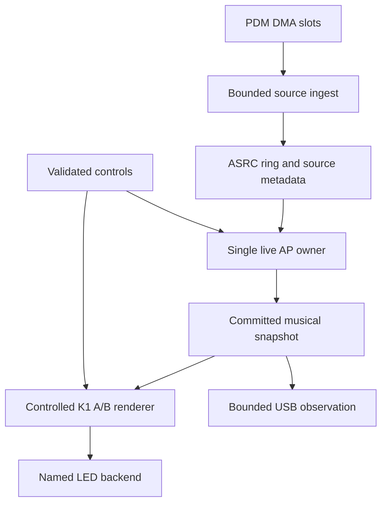

# Titan: live SpectraSynq K1 runtime — implementation and delivery plan

Date: 20 September 2026. This is a new execution plan. Do not amend the earlier takeover_execution_brief.

## 1. Mission, completion claims and execution priority

Deliver an identified Titan firmware image that runs the existing K1 audio-processing and visual-processing behaviour continuously from real audio, carries truthful time and continuity information, exposes useful musical observations and controls, and supports repeatable music-intelligence development.

The immediate implementation is the live runtime surrounding the already imported K1 algorithms. Do not substitute a new demonstration effect, a generic NPU benchmark, another portability survey or completion of the empty-TCM experiment for this delivery.

This plan defines five separate outcomes:

| Outcome | Exact meaning |
|---|---|
| LIVE_RUNTIME_IMPLEMENTED | Required source, host tests and ARM build checks pass. This alone is not an on-target result. |
| TITAN_LIVE_K1_DEV_READY | The exact live image passes the normal live execution, controls, observation and recovery cases in Phase 7. It can be used for music-intelligence development. |
| MUSIC_INTELLIGENCE_BASELINE_READY | Phase 8's recording, replay, same-input comparison and control workflow is executable on the accepted development baseline, with usable identified input. |
| K1_FEATURE_MIGRATION_COMPLETE | Every feature in the canonical-source coverage ledger is implemented and verified, or has an explicit user-authorised exclusion. Deferred or unknown features cannot be silently counted complete. |
| PRODUCT_QUALIFIED | The applicable transmitter, physical output, latency, optical and comparison gates are closed on the proper named configurations and Captain has made the required ruling. |

TITAN_LIVE_K1_DEV_READY does not depend on product four-lane wiring, optical KEEP, an RT1062 ruling, or the historical empty-TCM Q1–Q5 campaign. It does depend on honest sample consumption, useful signal observations, working controls, bounded resources and measured live operation.

The task is complete through the applicable outcome, not when another plan is written. Source implementation proceeds without a new permission request. Observe the existing operator Rearm protocol for physical programming. A missing analyser stops the wire measurement, not the independent runtime work.

The earlier 1–3 day allowance was a provisional estimate for the first development baseline. It is not a measured completion promise for full feature parity or product qualification. Track progress by the concrete phase exits below; do not replace implementation with repeated estimates.

### Evidence vocabulary

Use PASS, FAIL, BLOCKED, NOT_TESTED and NOT_APPLICABLE_WITH_REASON for individual acceptance rows. Use REPORTED_COMPLETE_PENDING_SOURCE_CHECK for the uncommitted changes described below until their local implementation has been inspected. Unknown data never becomes zero or PASS. An algorithm returning a finite estimate does not establish semantic accuracy.

All command names, files and APIs marked NEW are requirements to implement. They are not claimed to exist in the audited checkout. Existing commands are identified separately. Resolve unknown full hashes and local paths by the mandatory lookup rules; do not invent them.

## 2. Starting checkpoint and authoritative sources

### 2.1 Latest reported device and source state

| Item | Starting state |
|---|---|
| Firmware repository | https://github.com/synqing/SpectraSynq-K1-RA8P1-Firmware |
| Mac checkout | /Users/spectrasynq/Workspace_Management/Software/SpectraSynq-K1-RA8P1-Firmware |
| Branch/base | lane/k1-ra8p1-002 at 431140853dd8b58af53240ef84d5fb1a08bd8b45, with uncommitted takeover work |
| External evidence root | /Users/spectrasynq/Workspace_Management/EdgeAI_Artifacts/Titan/k1-ra8p1-002 |
| Titan UID | 545433931bd25436593630352d068363 |
| Application USB | VID:PID 045b:5310; last reported CDC /dev/cu.usbmodem00000000000011 |
| Reported resident image | live-audio-gpt-20260920-03; build c7f6034a…; HEX 3aa09139… |
| Programme proving that write | live-audio-gpt-prog-20260920-03 |
| Latest reported INFO | takeover-info-once-20260920-01/handoff-info.json; SHA-256 prefix c3fb0fe0… |
| AP contract | 24,000 samples/s; 180 samples/hop; 7,500 µs; 80 spectrum bins |
| Core/cache state | M85 owns AP+VP; M33 and U55 parked; D-cache disabled |
| Ownership | CDC released at last handback; recheck current owner before acquiring it |
| Physical status | Transmitter unadmitted; P601/DIN uncaptured; no analyser reported available |

Preserve the established microphone route: LinkMems LMD2718T261-OA1 capsules U13/U14, shared data P502/PDMDAT2 and clock P812/PDMCLK2. The expected programme mapping is U14 LOW → channel 2 RISE; U13 HIGH → channel 0 FALL is the measurement lane. Acoustic capsule identity remains unproved. Do not substitute an IM69D130 configuration or change capture gain/pin ownership as part of runtime extraction. Resolve the exact current gain and DMA channel/priority mapping from the identified build receipt and dirty source.

The prefixes above are identifiers for lookup, not usable full hashes. Recover complete values from local build, programme and INFO receipts and check agreement. A build ID, Git commit and HEX hash are different identities.

Reported completed work to preserve:

- Host capture scoring requires hashed raw files and retains illegal captured pulses as failures.
- Identity uses a bound checkpoint; observation-only runners restore settings; negative tests pass.
- CLI help, timeouts, log rotation and observe-path DTR/RTS false are repaired.
- Backend status distinguishes configured backend, emit-gated activity and physical_admission=unproven.
- Emit-cycle measurements are separated from AP-hop measurements.
- Explicit tempo placement empty-tcm/dtcm is implemented.
- Palette-path blend/policy derivatives, full logical output composition and TRUE16 0x12AB packing have host evidence.

Prepared timing assets are retained unchanged:

| Asset | Reported build ID | Reported HEX | Scope |
|---|---|---|---|
| Empty-TCM profiler | 8a78961b… | 22d405c1… | Built and map-checked, not reported run |
| Empty-TCM observer | 4ff1deea… | 28eda0d1… | Matched control, not reported run |
| Named DTCM variant | ed3e7567… | b618cb88… | Distinct placement experiment |
| Older profiler | See historical receipt | 9f12869a… | DTCM configuration; never relabel empty-TCM |

Q1-Q5-CAMPAIGN.md remains the record for that campaign. Its programmer waiter is not the default next live-runtime action and must not be started merely because its command is prepared.

### 2.2 Authority order

1. Current explicit user instructions, including delivering the actual K1 runtime and preserving the earlier takeover brief.
2. Root AGENTS.md and the applicable live-programming protocol.
3. Current local STATUS.md, reference manifest, source receipts and active ownership facts.
4. Pinned behavioural source: DualMCU commit 6b1e7bc5c9f9871e6ea4e900455bcb37d756304a.
5. Pinned BSP source: 6dd0a705d00ffbd6397c9a8c0199cbaa8eec41b7.
6. This plan's explicitly identified new implementation contracts.
7. Historical results, which remain valid only for their original scope.

Read the canonical platform package at /Users/spectrasynq/Workspace_Management/Software/agent-skills/packages/ra8p1-titan-engineering; run its platform_memory.py --check and recall pins, clocks, DMA and WS2816. If unavailable, use the repository-linked sources and state that limitation. Do not invent platform facts or substitute a stale plugin copy.

Read the local TITAN-MIC-LED2-SESSION-CANON.md before touching microphone or PHY/LED2 ownership. Preserve the existing checkout; do not create a sibling worktree for this slice, reset dirty work, or edit the DualMCU/BSP repositories. The separate Teensy lanes are outside this repository's implementation scope.

### 2.3 Findings established in the inspected source

Both remote branches were still at 4311408… when this plan was prepared. The Mac's newer dirty tree and external receipts were not accessible to this review. Reconcile these named findings locally; do not repeat general discovery.

| Surface at audited commit | Finding | Required intervention |
|---|---|---|
| fixture_app.cpp live poll | Calls fixture::Trajectory::process for live PCM | Introduce the live owner and keep fixture execution out of the live build |
| tests/target/trajectory.h | Sequence-derived capture time; publication time equals capture time | Supply source metadata and stamp measured availability |
| Same fixture adapter | Runs two rotating test channels before PaletteRuntime renders | Remove this duplicate live work; preserve fixture behaviour in fixture builds |
| pdm_target.c | A single pending AP hop can be replaced before consumption | Remove the pending-hop mailbox; use direct consumer-owned ASRC reads |
| ASRC push/pull | Failure may occur after partial mutation | Preflight the complete operation; failed readiness must be atomic |
| PDM rate lock/recovery | Lifetime counters can contaminate post-restart estimation | Per-epoch count/time deltas and rate segments |
| Capture/palette clocks | Different origins; DWT extension shared without protection | One common protected monotonic clock |
| Palette presence | Cached loud features can re-arm dwell at every render | Refresh presence on a new publication only; implement explicit freshness |
| Imported render scheduler | Contains the older 8 ms budget | Preserve as reference; do not blindly make it the live timing policy |
| Current broker | Rich MIR data is not exposed by the old observation interface | Add bounded snapshots/events and complete development controls |

Primary source anchors are listed in Appendix A.

## 3. Complete function coverage and what may remain separate

### 3.1 Canonical-source resolution

The RA8P1 manifest identifies the pinned DualMCU core as behavioural authority. It does not establish that every feature in the user's complete SpectraSynq_K1_Firmware has been migrated. The exact original repository/path was not established by this review; a lookup of that literal GitHub name did not resolve it.

During Phase 0:

1. Inspect the existing local reference manifest, import receipts and the read-only DualMCU repository's recorded provenance.
2. Locate the canonical original checkout/archive from its actual remote and local project records. Do not select an unrelated similarly named repository.
3. Record its absolute path, remote, commit or immutable archive hash, and relationship to the DualMCU pin.
4. If multiple candidates conflict, continue the known pinned-core runtime work and report the specific source-selection decision. Only the full-feature-parity claim is blocked by that unresolved authority.
5. Compare source by feature and application call path, not just files present or functions linked.
6. Do not move the pinned import reference to a newer HEAD as a shortcut.

Create ONE NEW machine-readable file, docs/evidence/K1-RA8P1-002/LIVE-K1-FEATURE-COVERAGE.json. Each row must contain feature_id, canonical_source_identity, source_paths_and_symbols, existing_titan_paths, implementation_state, runtime_entry, public_control_or_observation, required_test_ids, target_evidence and exclusion_authority. Allowed implementation states: IMPORTED_ONLY, LIVE_WIRED, HOST_VERIFIED, TARGET_VERIFIED, BLOCKED, USER_EXCLUDED. No bare DONE.

### 3.2 Required inventory

These rows must exist even if the answer is absent/deferred. Expand them to all functions found in the canonical application; do not silently narrow the inventory to the currently convenient subset.

| Function group | First live-development delivery | Full migration handling |
|---|---|---|
| Boot, runtime identity, diagnostics, status indication | Required; preserve working BSP/startup and status LED ownership | Verify boot and restart behaviour, including USB-disconnected startup |
| Onboard PDM capture, channel choice, sample conversion, gain/headroom | Required using current route and source contract | Preserve input selection semantics; quantify any input-quality limitation |
| Resampling and source/analysis/media clocks | Required; exact 24k/180 contract and metadata | Other source rates require separately declared adapters |
| GDFT/raw/postprocess and 80-bin spectrum | Required, existing algorithms | Preserve bin mapping and Nyquist validity |
| Energy, peak/RMS, novelty and silence input | Required | Preserve source computation and thresholds; separate missing data from silence |
| Chroma, chord and confidence | Required | Preserve A-origin chroma and unknown/no-chord semantics |
| Onset, bass onset, transient, kick/snare/hihat scores and event IDs | Required | These are scores/events, not separated audio stems |
| Tempo, beat phase, confidence, lock/coasting | Required | Do not demand a confident lock for every music genre or silence |
| Saliency and harmonic/rhythmic/timbral/dynamic axes | Required | Preserve raw/smoothed values and event thresholds |
| Musical time, predicted beats, event vs availability coordinates | Required as observable data | Physical beat-latch scheduling requires measured output timing |
| Per-channel audio focus | Required and independently controllable | Preserve shared AP ownership and per-channel transformations |
| Mode catalogue and 44 palettes | Required for all currently product-enabled modes | Reconcile any additional canonical modes explicitly |
| Palette transitions, interrupted transitions, hue/colour behaviour | Required; retain existing derivative identities | Do not replace with a new visual demonstration |
| Effects, authored history, blend, treatment, edge policy, gain and current limiter | Required logical path for both channels | Physical current/output limits require the actual hardware evidence |
| Centre-origin topology | Required for exposed motion; 160 pixels/channel, centres 79/80 | Bench 128 uses its existing mapped centre 63/64; do not change logical geometry |
| Director, hooks, standby and runtime policy switches | Required if present in the admitted core; explicit enable/readback | Existing heuristic scene labels must not be presented as validated ML classifications |
| Configuration, validation, get/set, presets and save/restore | Required for development via existing host; target persistence separately labelled | Implement canonical persistent storage after the specific storage region/driver is established |
| USB observation and control | Required; single CDC owner | USB audio-class input, if a canonical feature, is a separately enumerated adapter, not implied by CDC |
| Physical LED transmitter | Retain existing diagnostic activity with truthful status | Fresh wire diagnosis and admission; then actual physical lanes |
| BLE/radio/HMI/peer bridge | Enumerate and preserve API seams; not required for single-Titan MIR work | Implement target adapters when their actual hardware/peer is specified; never omit from full-parity accounting |
| Peer-clock exchange and multi-device synchronisation | Preserve imported contracts and tests | On-peer execution remains separate until peers exist |
| Model inference/U55 and optional M33 work | Preserve extension seams; no accelerator needed for first baseline | A named useful-model task gets its own coexistence and accuracy evidence |
| Update/recovery, errors and persistence migration | Exact recovery image and runtime fault behaviour required | Full updater/NVM features require canonical coverage and region-specific implementation |

At the audited pin, product_catalogue.cpp has 38 stable ordinals and 23 product-enabled modes. Enabled IDs are 3,7,8,9,11,12,13,14,15,16,18,19,20,21,22,23,24,25,26,27,28,29,32. Retain names/IDs and all 44 palette IDs. Disabled ordinals and diagnostics are not silently enabled or renumbered. Any newer authoritative catalogue must be recorded before changing this inventory.

## 4. Chosen implementation architecture

Use the current RT-Thread/FSP foundation, the existing DMA capture owners, the current 1,024-sample ASRC ring, the existing K1 AudioPipeline and PaletteRuntime. Add a dedicated live application path. Do not introduce another RTOS task or an application hop FIFO for the first implementation.



The ISR acknowledges and records a completed slot and its receipt time. Foreground ingest converts complete raw blocks and commits PCM/metadata. The live owner requests one complete resampled hop into its own storage, processes it once and commits a result. Rendering and observation consume completed snapshots. They cannot mutate AP history or trigger extra analysis.

### 4.1 New files and exact responsibilities

Use these NEW names unless the Mac tree already has an equivalent implementation with the same contract; in that case record the mapping and extend it rather than creating a duplicate.

| File / surface | Required responsibilities and functions |
|---|---|
| platform/ra8p1/live_audio_contract.h | C-compatible fixed-width hop/metadata/status definitions, enums, version and invariants |
| platform/ra8p1/live_clock.h and live_clock.c | k1_live_clock_initialise, k1_live_clock_sample, k1_live_clock_now_us, k1_live_clock_health; consistent extended cycles/microseconds and bounded wrap handling |
| platform/ra8p1/live_audio_runtime.h and .cpp | initialise, serviceOneHop, consume, invalidate, finalisePublication, latest; exactly one AudioPipeline/window/waveform owner |
| platform/ra8p1/live_app.h and .cpp | k1_live_initialise, k1_live_poll, k1_live_disconnect; service ordering, controls and renderer/backend orchestration |
| platform/ra8p1/live_protocol.h and .cpp | INFO capabilities, explicit wire encode/decode, snapshots/events/control responses, bounded payloads |
| platform/ra8p1/pdm_target.c/.h | Atomic source ingest, descriptor ownership, direct try_read_ap_hop, discontinuity/recovery/calibration |
| platform/ra8p1/k1_asrc_24k.c/.h | Exact full-operation readiness, atomic push/pull and successful-path compatibility |
| platform/ra8p1/palette_runtime.h and palette_runtime.cpp | Reset audio-owned history without losing controls; freshness/new-publication handling; one real render pair |
| platform/ra8p1/hal_entry.c | Build-selected live/fixture dispatch, shared clock, USB/PDM startup independence and service loop |
| scripts/build_scalar.py | Add explicit --live-runtime, dependencies/exclusions, source identity, live-specific linked-symbol checks |
| docs/contracts/titan-live-v1.json | NEW single authoritative protocol/control/capability manifest |
| tools/serial-studio/live_protocol.py | NEW host wire codec generated/checked against the manifest |
| tools/serial-studio/titan_live_control.py | NEW control client using the existing broker's local control endpoint |
| scripts/test_live_runtime.py | NEW aggregate host gate invoking the defined focused suites |
| scripts/run_live_k1.py | NEW target campaign runner using the same CDC owner |
| scripts/score_live_k1.py | NEW recomputable scorer for runtime/observation/control acceptance |
| tools/serial-studio/titan-live-mir.ssproj | NEW development view; keep archived SS-02 and existing projects intact |

### 4.2 Ownership and resource invariants

- One foreground live owner calls AudioPipeline::process. No ISR, observer or command calls it.
- One caller-owned 180-sample output buffer is reused after the previous hop is fully processed.
- DMA buffers remain in DMA-accessible SRAM. No DMA buffer moves to DTCM.
- Source-block metadata capacity is five entries: ceil(1024/296)+1. No dynamic allocation.
- Preserve two raw DMA slots per microphone and 296 source samples/slot; 296 is a multiple of the FSP-required eight.
- Render state is two channels ×160. Historical fixture channels are absent from the live image.
- No heap allocations in capture, ASRC, AP, renderer, publication, event logging or telemetry encoding after initialisation.
- Use existing reserve floors: stack_untouched_bytes >=4096 and heap free at recorded maximum >=32768. After all paths are primed, heap-used and heap-maximum growth must be zero in the measured run.
- Account static additions by exact sizeof/map, including snapshot buffers, event ring and metadata. Reserve checks apply to the resulting live build, not an older profiler.
- M33/U55 remain parked and D-cache disabled. Existing I-cache/FPU/compiler settings are recorded; do not change them incidentally.
- GPIO diagnostic and GPT cannot own P601 concurrently. Preserve the existing GPT/DMA mapping in the named source candidate; no speculative transmitter repair belongs in this refactor.

## 5. Phase 0 — bind the working baseline and close the scope ledger

**Owner:** implementing CLI agent. **Dependency:** none. **Exit:** exact starting source/assets, known feature scope and current ownership are recorded; implementation can proceed.

0.1 Read AGENTS.md, current local STATUS.md, REFERENCE-MANIFEST.md, the microphone session canon, latest build receipts and Q1-Q5-CAMPAIGN.md. Read the dirty diff on every overlapping path before editing it.

0.2 Record branch, base SHA, intended modified/untracked path list and content hashes. Preserve existing unrelated work. Do not blanket-add/reset/stash the tree. Preserve a patch plus any relevant new files in the existing external evidence convention when a commit is not yet authorised.

0.3 Run the existing scripts/check_references.sh. If a sibling HEAD moved, compare against the recorded pin, not the moving HEAD. Do not modify sibling repositories to make this check green.

0.4 Resolve the full resident/recovery hashes. Check programme UID, written HEX, build receipt and INFO agreement. Reuse the valid recent INFO if identity/ownership has not changed. If live acquisition is necessary, use the existing owner/broker and observation-only path.

0.5 Inspect the reported completed repairs once. Map each to its files and retained tests. Fix only an actual missing/inconsistent postcondition; do not reopen their complete historical campaigns.

0.6 Create/update the single feature-coverage JSON described in Section 3. Resolve canonical source identity using the stated rules. Missing canonical authority blocks a full-feature-complete label, not development of the known live core.

0.7 Mark the old empty-TCM campaign PREPARED_SEPARATE_EXPERIMENT in the working status. Preserve its assets and commands. Do not change their hashes or programme directories.

0.8 Capture the original complete K1 controls and audio policy from the source/runtime. These become the preservation baseline for refactoring, restoration and target testing. Do not use brightness 255 or enable automatic mode cycling as a test convenience.

**Evidence:** baseline.json, intended.diff or authorised commits, hashes of existing build/INFO/recovery receipts, feature-coverage rows and ownership state. Keep them under one new live-runtime campaign directory; do not create competing status ledgers.

## 6. Phase 1 — define the common clock and exact audio contracts

**Owner:** implementing agent. **Dependency:** Phase 0. **Exit:** contracts compile and their deterministic host tests pass.

### 6.1 Common monotonic clock

1. Initialise one clock from the existing free-running DWT and the verified runtime SystemCoreClock. Do not reset/reconfigure DWT after consumers begin.
2. Use the same origin for PDM completion receipts, AP start/end, publication, control application and rendering.
3. Extend 32-bit cycle deltas with unsigned modulo subtraction and uint64 accumulation. Protect the read/update of shared extension state using the existing bounded interrupt critical-section primitive. Restore the previous interrupt mask; never blindly enable interrupts on exit.
4. Convert accumulated cycles using quotient/remainder so long uptime cannot overflow a multiply by 1,000,000. Preserve fractional conversion remainder.
5. Keep the critical section to clock-state arithmetic. No buffer copies, JSON, AP, rendering or FSP transactions inside it.
6. Retain the RT-Thread tick consistency check. Compare independent tick elapsed time against the single-wrap interval, 2^32/SystemCoreClock seconds, with tick quantisation accounted for conservatively. If elapsed time can span a full wrap without an extension sample, mark timing ambiguous. A changed clock, wrap ambiguity or acknowledged debugger halt invalidates timing for that run and starts the controlled discontinuity path.
7. Debugger-halting runs cannot claim continuous clock qualification even if a stopped timebase makes the halt invisible to software.
8. Replace live uses of the independent PaletteClock/PDM origins. Historical fixture clock paths remain unchanged.

k1_live_clock_sample returns extended uint64 cycles and uint64 microseconds from one protected sample, plus health/origin identity. All trace timestamps use these extended cycles. Store ISR receipt cycles at capture time alongside receipt microseconds; never reconstruct them by multiplying rounded microseconds. Record verified clock_hz and clock-origin/session identity in every recording header.

### 6.2 Hop descriptor: NEW k1_audio_hop_t

Use fixed-width integer fields and a 180-element int16 PCM array. Internal C structure layout is not the USB wire layout. Define these fields in the contract header:

| Field | Meaning / invariant |
|---|---|
| contract_version, samples, analysis_rate_hz | Exactly 1,180,24000 |
| stream_epoch | Producer-owned uint64 continuity identity; scoped by boot/session identity |
| raw_capture_epoch | Actual driver's DMA continuity identity; distinct from the logical stream epoch |
| hop_sequence | uint64, begins at 1 in each stream epoch and increases once per successful hop read |
| analysis_begin, analysis_end_exclusive | uint64; end-begin=180; first interval[0,180) |
| source_identity, programme_lane | Actual selected input, not guessed capsule acoustic identity |
| source_first_index + first_frac_q16 | Source position used for first output |
| source_last_index + last_frac_q16 | Source position used for output 179 |
| source_next_index + next_frac_q16 | Next-hop boundary; distinct from newest output |
| source_support_last_index | Greatest source sample touched by interpolation |
| supporting_block_source_end_exclusive | End boundary of the newest supporting block; its newest sample is this value minus one |
| source_block_first/last_sequence | Actual contributing raw block sequence range |
| source_rate_hz, rate_segment, phase_increment_q16 | One declared rate/increment across all 180 outputs |
| supporting_dma_receipt_cycles, supporting_dma_receipt_us | Consistent extended-cycle/microsecond receipt for the block containing the newest supporting sample |
| newest_sample_capture_estimate_us | Reconstructible software back-projection, not acoustic time |
| descriptor_ready_us | Time the foreground finishes constructing this descriptor |
| timestamp_provenance | DMA_ISR_BACKPROJECTION, not MEASURED_ACOUSTIC |
| capture_estimate_valid, uncertainty_known, physical_timestamp_valid | Separate flags; unknown uncertainty is not 0; physical flag remains false here |
| discontinuity_reason, rate_state | Explicit reason; CALIBRATING or LOCKED |
| raw/gain clipping flags and associated block counts | Identify the source blocks; do not falsely claim per-hop exact rail allocation if only block totals exist |

The full consumer key is boot/session identity + stream_epoch + hop_sequence. Stream epoch may restart after a full MCU reset; the host must not merge pre/post-reset records on epoch number alone. On every reconnect, rebind INFO and start a new session. Detect same-connection clock/sequence regression as a reset/discontinuity, not reordered music.

Use a 64-bit absolute source-index counter plus separate Q16 fractional phase. Do not pack a growing absolute sample index into a 64-bit Q16 value that unnecessarily shortens uptime.

### 6.3 Media and availability rules

- analysis_end_exclusive×2 is the established AP hop-end MEDIA_TIME_48K boundary; first completed hop ends at 360.
- The newest actual output sample is analysis_end_exclusive-1; its media position is that index×2. Keep it separate from the exclusive boundary.
- Preserve the established AP input boundary convention to avoid shifting detector trajectories by one sample. Put the conversion in one named adapter and test first-hop/off-by-one cases.
- features.capture_time_us is explicitly the descriptor's newest-output-sample receipt proxy. Its supporting source/media position remains in the envelope.
- features.publish_time_us is measured after processing, immediately before publishing the completed result. Never copy capture time into it.
- source_frame_ms remains a media-domain value derived from the established AP boundary; do not replace it with foreground wall time.
- Use AnalysisStamp for the declared source support and availability. Do not subtract a universal GDFT-window centroid from onset/beat events.
- Same-epoch capture proxy <= descriptor_ready <= AP start <= AP finish <= publication must hold for valid data. An impossible estimate is invalidated, not clamped to satisfy the inequality.
- Event coordinates, prediction coordinates and actual result availability are different fields. Label all units and inclusive/exclusive conventions in the protocol manifest.

### 6.4 Phase 1 tests

Fake-clock tests cover a DWT wrap, ISR/foreground interleaving, long integer conversion, origin equality, clock-change rejection and invalid timing state. Contract tests cover the first two hop intervals, source fractional carry, media conversion, stale epoch and duplicate descriptor rejection. No physical timestamp claim is part of these tests.

## 7. Phase 2 — make capture, ASRC and recovery accountable

**Dependency:** Phase 1 contracts. **Exit:** complete ordered PCM delivery or explicit discontinuity; no silent overwrite and no partial failed operation.

### 7.1 Atomic ASRC operations

Preserve successful interpolation arithmetic and output bytes. The rate increment remains:

```
inc = floor(source_hz * 65536 / 24000)
```

For push: first validate filled <=1024 and all ring-index invariants, then all arguments and count <=1024-filled before writing any sample or index. Corrupt occupancy/index state returns FAULT; capacity arithmetic must not wrap. A rejected push leaves stream state and PCM unchanged, apart from a dedicated rejection counter.

For a pull of 180 outputs, with current integer relative index s and fractional phase f, precompute in uint64:

```
last_required = s + floor((f + 179*inc)/65536) + 2
consume_count = s + floor((f + 180*inc)/65536)
required      = max(last_required, consume_count)
```

If filled<required, return NOT_READY without changing ring state, phase, production count or caller output. Routine NOT_READY is not an audio-loss error. Remove the hard-coded filled>=320 readiness test.

On success, produce exactly 180 samples, consume exactly consume_count, retain the correct next fractional phase and advance the successful-output counter by 180. Preserve the following interpolation support sample even when its coefficient is zero in the existing arithmetic.

### 7.2 Replace the pending-hop mailbox

Implement:

```c
k1_audio_read_result_t
k1_pdm_target_try_read_ap_hop(k1_audio_hop_t *out);
```

Required results: OK, NOT_READY, DISCONTINUITY and FAULT.

- pdm_target_poll ingests complete raw blocks only; it no longer writes capture_ap_hop or capture_ap_hop_ready.
- try_read_ap_hop constructs exactly one complete descriptor and resamples directly into the live owner's buffer.
- The caller immediately processes or explicitly rejects that hop before requesting another.
- No other live caller can consume ASRC samples.
- Existing sample-only diagnostic APIs may remain behind diagnostic build guards if required; the live build cannot silently fall back to them.

### 7.3 Source metadata and sample ownership

1. Acquire the exact DMA epoch/sequence/slot token before reading.
2. Pair programme/measurement blocks by raw_capture_epoch AND sequence. A mismatch is rejected explicitly; never pair equal sequence values from different raw epochs. Logical stream_epoch never substitutes for the driver's ownership token.
3. Count actual completed samples separately from samples admitted into ASRC.
4. Convert the full 296-sample programme block while owned, using the retained unpack/gain arithmetic. Record raw rail and gain-clipping data separately.
5. Ensure both PCM and metadata capacity are available before committing either. A metadata-capacity failure cannot leave untracked PCM in the ring.
6. Store source index interval, raw sequence, raw/logical epochs, consistent completion cycles/microseconds and quality in the five-entry metadata ring.
7. Release the DMA token promptly after copying/committing. No AP object or snapshot retains a pointer into a raw DMA slot.
8. Retire metadata only when no unread PCM or interpolation support references it.
9. For a hop spanning blocks, retain first/last contributing sequence and use the correct newest supporting block. Do not use the previous pair's capture_last_end_us.

### 7.4 Rate estimation and time mapping

For each programme completion record actual completed source count and that programme block's common-clock ISR receipt. Use within-epoch differences after at least the existing two-second calibration interval:

```
measured_hz = completed_sample_delta * 1000000 / receipt_time_delta
```

The two endpoints must describe matching sample/time boundaries. Exclude downtime across a restart. Do not use lifetime processed counts or the later of the two microphone receipts.

Accept only the existing 36,000–44,000Hz range. An out-of-range result remains visible and unlocked; do not clamp it to a passing value.

Apply a newly accepted rate at a complete AP-hop boundary. Increment rate_segment, preserve continuous source phase/buffered PCM and reset the local correlation fit. One hop cannot contain two increments. A continuous rate adjustment is not itself a capture-epoch break.

For the newest output's fractional source position q_index + q_frac/65536, use the supporting block's newest source sample r = supporting_block_source_end_exclusive - 1. This is not necessarily source_support_last_index. Calculate exactly:

```
delta_q16 = (r - q_index) * 65536 - q_frac
delta_us  = floor(delta_q16 * 1000000 / (65536 * source_rate_hz))
newest_sample_capture_estimate_us = supporting_dma_receipt_us - delta_us
```

Validate ordering and multiplication/subtraction bounds before calculation; underflow/overflow invalidates the estimate instead of clamping it. Retain q, r, rate and raw receipt so the host can recompute the estimate. This is a software receipt proxy. Microphone/filter/FIFO/ISR latency is not measured or subtracted.

Feed the existing MediaTimeCorrelation only observations joining the same media position to this corresponding proxy. Never fit AP dequeue/completion delays into the source clock. Wrap the fitter with explicit proxy validity and uncertainty-known flags. If its integer uncertainty interface needs a sentinel, use UINT32_MAX for unknown and preserve that meaning outside the fitter; never export it as a measured bound. A valid mathematical fit permits local scheduling estimates, not a physical-latency stamp.

### 7.5 One discontinuity path

Implement a producer-owned request_discontinuity(reason) and service_discontinuity() path for DMA loss, source gap, mismatched epoch, ASRC capacity failure, clock invalidity and source/restart transitions.

Sequence:

1. Record the reason, old epoch and exact known completed/discarded counts. Record unknown hardware loss separately.
2. Stop admitting old-epoch data.
3. Invalidate the live publication/prediction immediately; do not allow a cached loud frame to remain “fresh.”
4. Discard and count incomplete ASRC PCM and metadata.
5. For a hardware fault, execute the existing stop/release/recover sequence. For a software reset with hardware continuity intact, discard/account old ASRC state and currently READY old-stream blocks, preserving each raw DMA token until properly released. The next complete programme block admitted after this boundary defines logical source index zero. Preserve raw_capture_epoch and physical slot ownership; never write the new logical stream_epoch into an acquired DMA token. Do not reset GPT or unrelated peripherals.
6. Advance the producer-owned stream epoch, reset within-epoch indices and rate-calibration observations, and clear pending hop state.
7. The AP owner resets its audio-dependent state before admitting the first new-epoch hop.
8. Preserve user controls and non-audio configuration.
9. A driver recovery failure enters FAULT with its exact FSP result. Do not spin in an unbounded retry loop.
10. Resume on a complete valid new-epoch hop. The normal-run zero-loss acceptance has already failed; successful recovery is separate evidence.

### 7.6 Accounting equations

Take consistent snapshots outside an in-progress ownership transfer:

```
raw_completed_samples =
    raw_ingested_samples
  + explicitly_discarded_complete_samples
  + ready_or_consumer_owned_complete_samples

hops_returned_to_live_owner =
    ap_completed_hops + ap_failed_hops + ap_inflight_hops

ap_inflight_hops is 0 or 1
```

Track ASRC source samples consumed, buffered and explicitly discarded as a separate equation. Unknown hardware loss and partial tails do not get invented counts to balance an equation. Deprecate the ambiguous ap_hops label or preserve it only as an explicitly named legacy production count; expose actual AP consumption.

### 7.7 Phase 2 tests

Required tests: atomic failed push; required-1 versus exact-required pull at 36k/40k/~41.4k/44k; successful-path bit equality; chunking invariance; PCM/metadata ring wrap; fractional/index carry; rate change at boundary; recovery after prior lock and downtime; delayed consumer; stale-token/mixed-epoch rejection; source-loss injection; no interpolation across a gap; and end-of-test accounting.

Each failure test must assert unchanged protected state or the exact declared discontinuity. A generic error return is insufficient.

## 8. Phase 3 — implement the live AP owner and coherent publication

**Dependency:** Phases 1–2. **Exit:** live input executes the canonical analysis once per delivered hop, with correct epoch/reset behaviour and a completed musical snapshot.

### 8.1 Live owner state

LiveAudioRuntime owns exactly:

- One existing AudioPipeline.
- One existing GdftSampleWindow.
- One existing VisualWaveformHistory.
- One reusable k1_audio_hop_t.
- One private output under construction and one committed publication.
- Media correlation and its proxy/validity wrapper.
- Counters and bounded timing summaries.
- Current epoch, accepted hop sequence and publication generation.

No fixture::Trajectory, fixture ChannelRenderState pair or test-mode carousel is a member. No renderer is called from consume().

### 8.2 Function execution contract

**initialise():** zero owned histories/counters, initialise the existing AP, mark publication unavailable, set WARMING and capture the immutable runtime configuration identity. Initialise user controls elsewhere; this function does not silently overwrite them.

**serviceOneHop():**

1. Call try_read_ap_hop once.
2. NOT_READY: return without changing AP history, logical sample position or publication generation.
3. DISCONTINUITY/FAULT: call invalidate with the supplied reason; return the precise state.
4. OK: mark one hop in flight, call consume, then account completion/failure. Do not request another hop recursively.

**consume(hop):**

1. Validate version, rate, length, source identity, source-phase support, same-epoch sequence and analysis interval. Reject impossible or duplicate data before moving the GDFT window.
2. On a valid new epoch, reset all continuity-owned AP state before processing: AudioPipeline::reset, GDFT samples, waveform history, clock correlation and musical prediction.
3. Advance the sample window with exactly 180 samples once; compute peak and RMS with the existing arithmetic.
4. Build AudioPipelineInput from the descriptor and established AP media boundary. Preserve algorithm configuration and silence semantics; do not introduce a new detector threshold while migrating.
5. Record AP start, call the existing AudioPipeline::process exactly once, then record AP finish.
6. Update the matching waveform history once.
7. Finalise the private output as described below.
8. Commit output, source descriptor, quality, waveform generation and publication generation together.
9. Append any newly occurring musical events to the bounded event log.
10. Return; AP processing must not render, emit, encode JSON or send USB traffic.

**invalidate(reason):** immediately mark the publication unusable for new musical events; record reason/epoch; clear predictions/correlation and signal the renderer to reset or age its audio-owned history under Phase 4. Keep controls intact.

**latest():** read-only access to the last fully committed publication. Its generation, waveform association and all arrays refer to the same AP result.

### 8.3 Warmup and missing data

The checked GDFT sample storage is 4,096 samples. For this delivery, declare full-window warmup complete only after 23 successful contiguous 180-sample hops in the new epoch. Report the number of real samples accumulated; zero padding is not captured silence.

Algorithm values may be displayed while WARMING, with their state visibly marked. Warmup completion does not force tempo lock or establish chord accuracy. Retain the existing detectors' confidence and coasting behaviour.

No hop available means source not ready. A source stall means stale/missing data. Neither is converted into fabricated zero PCM. Silence is concluded from captured samples and the existing K1 policy.

### 8.4 Finalise publication without retiming the music

Implement finalisePublication on a PRIVATE AudioPipelineOutput before committing it:

1. Preserve detector event times, tempo phase and musical anchors derived from source media time.
2. Stamp features.publish_time_us with common-clock time after AP computation. Record AP finish separately if publication assembly adds time.
3. Retain the capture proxy, source interval and rate segment in the publication envelope.
4. Map measured result availability into the same media epoch only when the local correlation wrapper is valid.
5. For predicted_next_beat.beat_result_available_frame, use ceil(mapped publication media position), with checked finite/nonnegative/range conversion. Do not leave the fixture hop-end placeholder presented as measured availability.
6. If mapping is unavailable, mark mapped availability invalid in the envelope. Consumers that cannot represent that distinction must receive predicted_next_beat_valid=false rather than a fabricated coordinate.
7. If a prediction's event position is already past when published, expose prediction_expired=true. Do not silently move its beat index or alter the original event estimate.
8. A later explicit request for the next future beat may use MusicalTime and the current mapped position; it must be labelled a new prediction.
9. Do not modify an already published object after a reader can see it.

Current detectors use source_frame_ms/media coordinates for their computation. Check that remains true in the Mac source before using an AP-start placeholder for input.publish_time_us and finalising it afterward. If a downstream detector actually consumes that field during processing, separate input readiness from result publication through a named live-only derivative; do not hide a semantic change.

### 8.5 Live main-loop order

Preserve the framework and implement one bounded foreground iteration:

1. Service clock/health and queued hardware completion bookkeeping.
2. Service PDM: at most the two physical READY pairs per call, preserving tokens and metadata.
3. Service any required discontinuity transition.
4. Process at most one complete AP hop.
5. Poll GPT completion/fault state without waiting for a transfer to finish.
6. Apply at most one fully validated pending control transaction at the shared safe boundary.
7. If another complete AP hop is already ready, defer lower-priority rendering/telemetry encoding to the next iteration.
8. Otherwise perform at most one due A/B render pair and one permitted output submission.
9. Service one bounded USB request/event and advance nonblocking transmission of already encoded data.
10. Return to capture service. Never spin until every producer/consumer queue is empty.

Within the actual FSP integration, USB hardware-event servicing that must occur earlier can stay earlier, but it must remain bounded and must not execute a fixture/AP command in the live profile. Preserve the one-outstanding-transaction transport.

Start the local USB driver before enabling capture, then initialise PDM without waiting for a host application's CDC open or USB_STATUS_CONFIGURED. Continue capture service through USB attach/detach. Measure enumeration/reconnect cost. If a vendor operation blocks long enough to lose capture, repair the platform service ordering; do not restore a hidden host-connection dependency and call startup autonomous.

A physical power-only/no-host boot test is required for the standalone-boot coverage row when that setup exists. Its absence does not block MIR development over the currently available Mac connection, but the row stays NOT_TESTED.

### 8.6 Actual service and compute bounds

At the accepted maximum 44kHz source rate:

- One 296-sample DMA interval is 6,727.272…µs.
- The 1,024-sample ASRC capacity represents 23,272.727…µs of source data.
- Two DMA slots do not permit a 13.45ms foreground blackout: after the next slot starts filling, the completed slot must be released within one source-block interval.

Track maximum completion-to-release delay and maximum uninterrupted AP/VP/telemetry sections. The minimum release interval over the allowed rate range governs the safety bound, not the ASRC ring's total capacity.

If a measured AP section exceeds the raw-slot release window, insert a bounded capture-only service hook at an existing AP stage boundary or the already implemented tempo-slice boundary. The hook may ingest raw blocks and update pending capture metadata; it cannot recursively run AP, render, apply controls or mutate the current hop. If it discovers a discontinuity during AP, mark the in-flight result invalid before publication.

Apply such a hook as a named live-only derivative with preserved numerical-output tests. Do not change the frozen fixture to accommodate it. If sustained compute demand still exceeds available service, measure the responsible stage and implement the smallest bounded correction. No queue increase or nominal rate reduction may conceal overload.

### 8.7 Phase 3 tests

- Exact same PCM/media input produces the same AP numerical/event trajectories as the canonical core. Exclude only explicitly different platform timestamp/provenance fields; do not normalise away event IDs, tempo or confidence differences.
- Duplicate or skipped descriptors cannot silently advance the analysis window.
- Epoch/reset clears AP, tempo, onset, saliency, waveform and old predictions.
- Publication-delay injection changes availability/cost while leaving source/event coordinates unchanged.
- Warmup ends on the declared contiguous sample count.
- Exactly one live AP call per successful descriptor; zero fixture-render calls.
- Invalid/incomplete output never replaces a previously committed snapshot as valid.
- Reentrant capture-only service cannot recursively invoke AP or publish across an epoch fault.

## 9. Phase 4 — connect the real K1 renderer, controls and output path

**Dependency:** Phase 3 publication. **Exit:** one controlled A/B render path consumes coherent live features and preserves K1 behaviour.

### 9.1 Audio-to-visual seam

Build VisualAudioFrameView from one committed generation: features, tempo, matching waveform and genuine source publication time. Do not splice tempo from generationN with spectrum fromN+1.

PaletteRuntime remains the owner of the actual controlled channels. Maintain the existing 8333µs bench/GPT cadence for this profile. Do not adopt the imported RealtimeRenderScheduler's obsolete 8ms/1.2ms constants. Preserve the imported module as reference until physical event-latch scheduling is separately configured with measured costs.

Render at most once per due frame. Count skipped releases; do not emit a burst of catch-up renders. The two logical channels both render regardless of which existing bench channel is physically selected.

### 9.2 Freshness, presence, silence and recovery

Define NEW development constant live_feature_stale_us=30000, equal to four AP periods. This is an explicit freshness policy for this delivery, not a measured latency ceiling. Store it in the manifest/build identity; changing it requires a new candidate and the same stale-input tests.

- Refresh musical-presence last_live_us only when accepting a NEW valid publication generation that meets the existing musical-presence test.
- Use that publication's timestamp, not the time of each render.
- Reusing a fresh snapshot for another render must not duplicate an onset/beat or extend presence.
- After 30ms without a new usable generation, mark input stale. Clear new-event eligibility and age existing authored history through the existing decay path. Do not feed a cached loud waveform as fresh music.
- Captured quiet audio follows the existing five-second dwell and subsequent decay. Missing input is explicitly distinguished from measured silence.
- On an epoch break, clear audio-dependent render history and deduplication before using the new epoch; preserve controls and palette-transition ownership.

Implement PaletteRuntime::resetAudioState(now_us). Clear channel frame/previous/scratch buffers through their existing spans; reset ChannelEffectState and ProductOutputTreatmentState; prepare neutral focused audio; reset dwell/event-generation and pending audio associations. Preserve ChannelVisualControls, AudioFocusProfile, palette selections, transition objects/pointers and configured output. Do not reconstruct objects in a way that leaves transition pointers dangling.

### 9.3 Full composition and parameter ownership

Use the already completed palette-path derivative integration. Verify this exact order once in its actual live call graph:

```
shared AP
 -> global product audio policy
 -> per-channel audio focus
 -> effective scene/visual controls
 -> effects
 -> blend
 -> output treatment
 -> edge policy
 -> output gain
 -> joint current limit
 -> stage/show adapter
```

Preserve base user configuration separately from effective per-frame controls. Director/hooks may derive effective controls but must not repeatedly multiply and overwrite the saved user settings. A readback after 100 renders must return unchanged base settings unless an actual user control transaction occurred.

Label raw capture gain, global feature sensitivity, per-channel focus and output brightness as different stages. Do not apply one stage twice. Raw capture gain remains the current source-configured policy unless a separately defined control is deliberately implemented.

Joint current limiting may legitimately scale channelB when an increase onA raises combined demand. Test A/B isolation before the joint limiter; test coupled limiting explicitly afterward.

TRUE16 test 0x12AB must pass through the actual wide submit/pack path. Pixel8×257 is only the current renderer-to-wire adapter. It is not arbitrary 16-bit colour precision and is not a wire capture.

Retain the established 128-pixel bench mapping. P004 has no selected GPT route. Four physical product lanes and additional wiring remain in Phase 10.

### 9.4 Control inventory and manifest

The NEW control manifest must enumerate every admitted ChannelVisualControls member, every AudioFocusProfile member/80-bin/12-chroma gain array, ProductRuntimePolicy, master output gain, palette/transition/travel settings, output-channel selection and emit state. Do not limit the surface to mode/palette/brightness.

For each control record:

- Stable field ID/name, type, channel scope and unit.
- Default and accepted range/enum.
- Exact application stage.
- Whether a change resets history, changes only future frames, or opens an input epoch.
- Base versus effective readback.
- Persistence scope: volatile target, host preset, or implemented NVM.
- Source symbol and required tests.

Resolve bounds from the canonical validators/consumption paths. Where no meaningful range exists, define a bounded local derivative and its boundary tests BEFORE advertising that field as writable. Do not accept arbitrary floats, silently clamp invalid input or invent limits in only the UI. A field remains explicitly read-only with a reason until its validation is implemented; that remains an open full-control coverage row.

Required control groups:

| Group | Members to cover |
|---|---|
| Channel identity/selection | enabled, mode_id, palette_id, effect_id where used; preserve catalogue ordinals |
| Light/colour | photons_id, brightness, chroma, mood, saturation, hue position/shift, chroma_value, hue_shifting_mix |
| Treatment | square_iterations, incandescent_filter/mode, bulb_opacity, base coat/intensity, prism controls, dithering |
| Geometry | mirror, reverse/travel settings; centre-origin constraint remains enforced |
| Existing VP tuning | All admitted vp_fix flags and bloom/waveform parameters from ChannelVisualControls |
| Audio focus | Level, novelty, low/mid/high, tonal, onset/bass/beat/transient/kick/snare/hihat gains;80 spectrum gains;12 chroma gains |
| Runtime policy | sensitivity, standby, chromagram range, current limit, director/assist/autonomy/confidence/dwell, hooks and edge policy |
| Output/session | master gain, selected bench channel, emit enabled, transition/travel duration, observation level |

samples_per_chunk and analysis rate are read-only180/24000 in this profile. Pin ownership, DMA mapping, arbitrary memory/register access and programming are not tuning controls.

Preserve the existing version 1/2/3 palette configure meanings. NEW complete live configuration uses a separate versioned operation; do not quietly expand an old payload.

### 9.5 Phase 4 tests

Cover every advertised writable field through encode/validate/apply/readback. Test A/B isolation, unsupported IDs, NaN/Inf, array length, stale revision, interrupted palette morph, base/effective separation, brightness once, joint limiting, TRUE16 packing, centre origin, stale loud snapshot, silence/dwell, epoch recovery and event deduplication.

Use representative distinct enabled modes on target; all enabled modes and all 44 palettes receive host catalogue/render coverage. Do not require every Cartesian combination in the room.

## 10. Phase 5 — deliver useful MIR observation and safe live control

**Dependency:** Phases 3–4 contracts. Host codec/broker work may proceed while target integration is built. **Exit:** the same existing CDC owner provides bounded, identity-bound musical data and controls.

### 10.1 Transport and capability contract

Preserve the existing framed transport's header/body CRC, request ID matching, maximum-response bounds, one outstanding request and quarantine on framing failure.

Add INFO capabilities: runtime_kind=live, live protocol version, schema hash, control-manifest hash, supported operations,80/12 feature counts, AP rate/hop, configured backend and exact source/build identity.

Reserve NEW operations 23 (snapshot), 24 (events), 25 (live configuration) and 26 (timing history) ONLY after checking the newer local opcode registry. If any is occupied, allocate the first contiguous unused group of four above the highest current opcode, record it once in titan-live-v1.json and generate firmware/host constants from that file. Subsequent operation numbers in this plan mean those assigned roles; do not silently reuse an occupied operation.

Maximum body for each new response is 4096 bytes. Encode fixed little-endian fields explicitly; AudioFeaturesV1 is NOT a wire structure. Do not memcpy C/C++ object padding into USB.

The schema manifest defines field order, width, validity and array counts. For the MIR field inventory, mirror every field already enumerated by the canonical fixture serialise function into a live-owned schema; do not call or link the fixture adapter to encode live data. Preserve float32 values and fixed-width integers, including signed Q32 bit patterns. Firmware/host schema hashes must agree.

The complete MIR snapshot, excluding configuration arrays available through GET_CONFIG, must fit one response. Include configuration revision/hash and effective-state identifiers so the host joins the matching complete base configuration. Enforce encoded-size assertions at build time; no silent truncation of MIR fields.

### 10.2 Snapshot content

A read returns the latest committed snapshot and separate current health, each with its own capture/generation timestamp where needed. A snapshot read never runs AP, renders a frame, changes configuration or resets counters.

| Group | Required content |
|---|---|
| Identity/source | UID/build/source pin, runtime kind, host session binding, stream epoch, hop/publication sequence, config revision, live/replay origin |
| Input integrity | raw completed/ingested/discarded counts, ASRC occupancy/high-water, AP consumed/failed/inflight counts, sequence gaps, recovery reason, raw/AP peak and RMS where measured, both rail signs and gain clipping |
| Spectrum | all 80 bins, source frequency/bin configuration identity, Nyquist-safe upper bin, low/mid/high/total energy |
| Tonality | all 12 A-origin chroma values, strength, chord type/root/confidence and component strengths |
| Events | onset/bass onset, transient/kick/snare/hihat IDs, strengths and levels; original event coordinates and availability |
| Tempo | BPM, phase, confidence, lock, beat_tick, beat_strength and updated |
| Saliency | Four raw and smoothed novelty axes, overall/dominant state, threshold and event information |
| Musical time | Epoch/anchor/frame, beat index, Q32 period/phase error, lock/confidence and prediction/availability validity |
| Runtime timing | AP last/max/distribution, ready-to-publication delay, deadline/lateness counts, DMA release gap, VP cost/skips, telemetry service cost, output-submit cost separately |
| Visual/output | A/B base and effective controls, transition state, logical frame generations/CRCs, configured/active backend, observed DMA/stop/latch/fault counts, physical admission |

A missing field is unavailable, never 0. Preserve invalid/warming/stale states. Chroma labels are A,A#,B,C,C#,D,D#,E,F,F#,G,G#. Existing heuristic kick/snare/hihat and scene scores are not claims of audio separation or validated semantic classes.

Keep uint64 indices/times and Q32 values as exact integers in binary/Python and decimal strings at the host-JSON/JavaScript boundary. Do not round them through JavaScript Number.

### 10.3 Event history and bounded polling

Latest-only 10 Hz snapshots cannot retain every 133.3 Hz event. Implement a fixed 256-record event ring; aggregate newly occurring events from one AP generation into at most one record. The encoded record is exactly 192 bytes, explicitly little-endian:

| Offset | Fields in order | Width |
|---|---|---|
| 0 | cursor, stream_epoch, hop_sequence, publication_generation, analysis_end_exclusive, publication_us | Six uint64; 48 bytes |
| 48 | event_type_mask, validity_flags | Two uint32; 8 bytes |
| 56 | onset event ID, event_ms, event_age_ms | Three uint32; 12 bytes |
| 68 | onset strength, bass onset strength, beat phase, beat confidence, beat strength | Five float32; 20 bytes |
| 88 | transient/kick/snare/hihat event IDs | Four uint32; 16 bytes |
| 104 | transient/kick/snare/hihat strengths, then their levels | Eight float32; 32 bytes |
| 136 | saliency event frame_ms, overall_saliency, adaptive_threshold, age_ms, flags | uint32, float32, float32, uint32, uint32; 20 bytes |
| 156 | harmonic/rhythmic/timbral/dynamic novelty, then the four smoothed values | Eight float32; 32 bytes |
| 188 | reserved, encoded zero | uint32; 4 bytes |

Generate event-mask bits and source-field mappings from the manifest. Preserve native event IDs and coordinates; missing events clear their mask bits rather than inventing an event. The pinned saliency age/flags are uint16 and are zero-extended into their uint32 wire fields. Validate all mapped source widths against the pinned headers before freezing schema version 1; an incompatible newer source requires an explicit schema version change, never narrowing casts.

Event reads use a uint64 cursor and return at most 20 records, oldest/newest cursor and overwritten count. They are non-destructive/idempotent. An expired cursor returns an explicit gap and earliest available cursor. At maximum event-per-hop production, retention is approximately 1.92 s; 20-record reads at 10 Hz can drain 200 records/s. The 64-byte history header plus 20×192 bytes is 3,904 bytes. Account the 49,152-byte target event storage in the map.

Use 10Hz default MIR/event polling, with health polling consolidated where the same fields are available. Keep the old 1Hz platform/palette reads only when needed. Bound service to one outstanding request; do not queue a request for every missed polling tick.

Publish telemetry bytes, service time, coalesced snapshots and event overwrite counts. Slow dashboards may lose intermediate snapshots; the recorder must explicitly report event gaps. Observer or disk failure must not stop AP.

Timing history is separate: retain exactly 1,024 AP records, each 56 encoded bytes: stream_epoch and hop_sequence (uint64 each), supporting DMA receipt/AP start/AP finish/publication (four extended uint64 cycle timestamps), flags (uint32), and reserved zero (uint32). This uses 57,344 bytes before ring indices. Record every completed/failed attempted AP hop with explicit flags; never silently omit an outlier.

Operation 26 returns at most 64 timing records per request using the same idempotent cursor/gap semantics and 64-byte history header. Response size is at most 3,648 bytes. Drain at 10 Hz during declared recorded intervals; capacity is about 7.68 s and drain capacity is 640 records/s. Bind records to the boot/session clock origin and verified clock_hz. Convert cycle differences to time using integer arithmetic; do not mix independent clock samples.

For both history operations, the 64-byte header contains version(uint16), record_size(uint16), count(uint32), next_cursor/oldest_cursor/newest_cursor/overwritten_total/session_token/clock_hz (six uint64), flags(uint32), reserved-zero(uint32). Cursor refers to a record, not a musical event ID. Define empty-ring and expired-cursor flag bits in the manifest. Snapshot and event reads do not reset counters.

Record cursors start at 1 and increase once per appended record within the bound session. Request cursor is the first desired record, inclusive; next_cursor is one past the last returned. Empty history returns count=0, oldest=newest=0, next_cursor=1 and EMPTY. A request beyond the current newest returns count=0 and preserves the requested cursor; an expired cursor returns GAP and starts at the earliest retained record. Rebinding a session invalidates old cursors even if their numeric values coincide.

### 10.4 Existing broker and development identity

Retain titan_broker as the sole CDC owner. Preserve DTR/RTS false, existing identity repairs, error quarantine and log rotation.

Keep TCP 127.0.0.1:7778 receive-only. A dashboard connection never opens CDC and cannot send firmware mutations through that display stream.

Extend the same broker with one opt-in Unix-domain control socket inside its run directory, owner-only mode 0600. Validate path ownership, reject unsafe existing socket files and bound the pending mutation queue to one. Return BUSY instead of accumulating stale commands. The client library routes target-test phases through this owner; do not repeatedly stop/reopen CDC between phases.

Campaign mutations additionally require an exclusive broker control lease. Issue a random 128-bit lease token bound to the local client connection, candidate/session and saved configuration revision. The lease lasts 30 seconds and the active client renews it every 5 seconds. Other mutation clients receive BUSY; read-only clients continue. Expiry/disconnect stops new mutations and never triggers automatic restoration or replay. Reacquisition requires identity/readback reconciliation. Campaign restoration requires the same lease and the last revision actually applied by that campaign; a revision conflict is reported, not overwritten.

Keep these state fields independent:

- identity_bound: UID/build/source/contract agree with the exact candidate record.
- runtime_kind: reported live or fixture capability.
- development_ready: backed by the Phase 7 receipt for that build.
- transmitter_admission: unproven, failed or accepted with separately matched evidence.
- product_acceptance: independent.
- origin: live, replay or synthetic fixture.

An exact development candidate may be observed and controlled with transmitter_admission=unproven. Do not fabricate a physical accepted checkpoint, and do not weaken UID/build binding to make the dashboard usable.

### 10.5 Atomic configuration transactions

Operation 25 supports GET_SCHEMA, GET_CONFIG, SET_CONFIG and the bounded staging/test subcommands below. Firmware validates a complete SET against the typed manifest and expected configuration revision before applying any field.

GET_SCHEMA takes byte offset and maximum bytes. Return total length, schema SHA-256, returned offset/length and bytes; the response's fixed metadata is 64 bytes and data is at most 4,032 bytes. Reads past the end fail. The manifest is immutable for that build.

GET_CONFIG uses the same bounded pagination plus configuration revision. The first page binds a revision; every later page requests that revision. If it changed, return STALE_REVISION and the host discards/restarts the entire read. Do not assemble pages from different configurations.

SET contains expected revision, target group/channel, typed updates, a uint64 client request identity and payload digest. Reject unknown fields, type/length errors, invalid values and stale revisions atomically.

Implement a single fixed 16,384-byte staging buffer for a transaction too large for one body: BEGIN_SET declares total length, SHA-256, request ID and expected revision; APPEND_SET accepts only the next contiguous offset, at most 4,032 bytes; COMMIT_SET validates the complete digest and all fields before enqueuing application; ABORT_SET discards staging. No page applies a field. Staging expires after 5 seconds without progress, and clears on boot/session change or explicit abort. One-shot SET uses the same validator. Reject oversized total length before copying; measure and bound validation/hash work through capture service. Include staging storage in map/resource checks.

Apply one validated transaction between completed AP consumption and the next render. Increment config revision once; return applied revision, first affected generation and readback hash. Fetch full revision-bound readback through GET_CONFIG. Base user settings do not change merely because a director/hook derives effective controls.

Retain the last applied client request ID, digest and resulting revision in GET_CONFIG. An identical duplicate of that request returns the existing result without reapplication/revision increment; reuse with a different digest is rejected. A timed-out SET has an unknown outcome, not an assumed failure. Rebind/read back and resolve whether it applied before sending another mutation. Never repeat a mutation automatically across a new boot.

A source-affecting change requests the controlled input-epoch transition. A visual-only change follows its documented history/transition policy. A configuration request cannot alter pins, DMA, caches, source hashes or programming state.

Do not auto-replay mutations after reconnect. Rebind INFO/capabilities; reject restoration if the target/build changed. Preserve the same CDC handle across dashboard restarts.

Host presets contain schema hash, build/source compatibility, all base settings and persistence_scope=host. Target NVM is not claimed unless its explicit adapter is implemented and tested in Phase 9.

The only initial on-target fault-injection command is TEST_STALE_SOURCE_120MS. Advertise it as a development-test capability, require the exclusive campaign lease and exact identity, and reject while another injection/transaction is active. Duration is fixed in firmware at 120,000 microseconds; it is not an arbitrary pause or register-write command.

At the next safe boundary, suppress AP-hop delivery for 120 ms while continuing to service/copy/release DMA blocks. During the suppression, account complete programme blocks as intentional test discards instead of pushing them into ASRC; retain the previous publication for the normal 30 ms stale policy to detect. Emit injection start/end markers. At expiry, discard/account retained pre-test ASRC state and use the software discontinuity path before admitting the next complete block. The firmware ends suppression even if the client disconnects. This proves stale-consumer handling and a controlled new epoch; it does not prove real DMA-fault recovery. Keep raw-loss/recovery negatives in the deterministic ownership tests unless an actual hardware-loss campaign is separately named.

### 10.6 Development view and recorder

Extend/create the real Serial Studio project using supported installed widgets, grouped as input integrity, spectrum/chroma, onset/tempo, saliency, musical time/cost and A/B output/control. A scalar fallback with only four health metrics does not satisfy this phase.

Record exact decoded observations/events to NDJSON with raw response hashes or retained framed bytes. Recording headers contain source/build/schema, configuration and recording-asset identities. Phase markers use host time and are labelled as such; they are not acoustic arrival timestamps.

Replay is visibly marked and cannot issue controls. Preserve the existing archived projects and receipts.

### 10.7 Phase 5 tests

Required negatives: unknown/mismatched identity; wrong schema; truncated/oversize payload; CRC/request mismatch; nonfinite data; uint64/Q32 round-trip; mixed-generation snapshot; expired event/timing cursor; slow subscriber; recorder failure; replay mutation; stale config revision; mixed-revision pages; incomplete/bad-digest staging; lease contention/expiry; lost SET acknowledgement; duplicate request/mismatched digest; invalid partial update; disconnect during pending control; attempted restore to a changed image; and the bounded injection's autonomous expiry.

Demonstrate that every observation-only command leaves AP history, controls, counters with reset semantics and renderer invocation count unchanged, except explicitly measured observation-service counters.

## 11. Phase 6 — build isolation, host gates and programming readiness

**Dependency:** Phases 1–5 implementation. **Exit:** one named live candidate is reproducibly built and prepared for the operator transition.

### 11.1 Live build selection

Add --live-runtime to build_scalar.py. It requires --pdm-target, --palette-runtime and the intended existing GPT bench backend for this first combined candidate. It forbids --resident-controls, --stage-profile, --npu-model, --p4-source, --pcm1808-target and --palette-ws2816 for this profile. Keep historical profiles usable and separately identified.

The firmware source selection must exclude fixture::Trajectory and its test render channels from the live executable. Preserve protocol framing/INFO/platform diagnostics by extracting shared transport code or build-guarded dispatch; do not instantiate the fixture just to reuse its protocol implementation.

Frozen fixture replay/profile images remain available. New live sources, contracts and derivatives must not silently alter the frozen fixture's PCM, expected trajectories or timing configuration.

Read the exact current live build receipt and preserve its working compiler/driver/backend settings. Record deliberate changes. Do not assume a historical G4 configuration applies merely because it passed.

For the new live candidate, record explicit application TCM placement. Start with the prior live image's actual placement when established; otherwise select empty-tcm explicitly and label that new choice. DMA remains in SRAM. A later measured compute repair may use an existing named scalar optimisation, but it creates a distinct candidate and retains equivalence tests.

### 11.2 Required build evidence

Retain source/diff identity, base Git SHA, generated-source hashes, behavioural/BSP pins, compiler version, exact command, macros, effective flags, map, symbol list, ELF and HEX hashes.

Require live symbols/call paths, AudioPipeline::process, controlled product rendering and the selected PDM/GPT owners. Require the absence of fixture::Trajectory/test render channels in the live executable. Checking one symbol name is insufficient if a second call path still performs test rendering; use a host invocation counter and call-path inspection.

Verify no new unexpected core/cache use, no runtime allocation path and all reserved SRAM/stack/heap requirements.

### 11.3 Host gate: NEW scripts/test_live_runtime.py

Implement a single explicit gate runner, with sub-suite selectors clock, asrc, ownership, live-ap, renderer, protocol, controls, build-isolation and all. It must return nonzero on any failed required assertion and write a JSON result listing the actual test cases.

Reuse existing ASRC, PDM, palette, output, identity and protocol tests. Add the meaningful tests defined in this plan. Do not rerun the entire historical 14,000-hop target parity corpus solely because telemetry/documentation changed.

Before programming, require all affected host suites, one numerical live-adapter/reference comparison with the frozen input bytes, negative ownership/timing/protocol tests, and the ARM/map gate. Preserve failures; rerun the affected suite after repair.

### 11.4 Programme readiness and operator protocol

Prepare the candidate, full hashes, verified recovery asset, fresh programme/run directories, exact programmer command and bound live runner before asking for the operator transition.

The established programme_scalar.py interface is:

```
python3 scripts/programme_scalar.py \
  --build "$TITAN_LIVE_BUILD_DIR" \
  --output "$TITAN_NEW_PROGRAMME_DIR" \
  --wait-seconds 180 --execute
```

This is a TEMPLATE until variables are replaced with the validated absolute paths. The implementing agent must place the fully expanded exact command in the campaign record.

On explicit Rearm: start that prepared waiter first, then reply exactly WAITING. Relay ROM seen, identified/writing, WRITE_VERIFIED and application identity promptly. Give release/reset instructions once only if still necessary. Never reuse an existing programme/run directory.

After write verification, bind live INFO to the intended UID, full build/source/HEX identity and live capabilities. A mismatch stops the target run. Do not label a recovery image resident until its own write and INFO have been observed.

A failed attempt remains a failed immutable receipt. Diagnose the actual failure before another attempt; do not invent a blanket one-attempt rule, and do not blind-retry flashing.

## 12. Phase 7 — prove the usable live development baseline

**Dependency:** Phase 6 identified application. **Exit:** exact-scope TITAN_LIVE_K1_DEV_READY or a specific failed criterion with its bounded repair.

Implement NEW scripts/run_live_k1.py and scripts/score_live_k1.py. Both use the manifest and existing broker. The older observation-only runners remain observation tools and are not silently promoted to this acceptance role.

### 12.1 Campaign inputs and state preservation

Before a run, bind build/programme/INFO hashes, source/contract/schema hashes, selected input/rate policy, complete configuration, observer profile, logical geometry and physical output state.

Use named, hashed real music recordings already available to the user. No synthetic room tones/white noise and no indefinite same-song loop. A short finite repeat for a specified comparison must be recorded; digital host fixtures remain silent.

Acquire the exclusive campaign control lease, then save the complete configuration, playback settings and ownership before temporary changes. Restore at the end only if candidate/session, lease and expected final campaign revision still match. On identity or revision conflict, refuse automatic target restoration and report exactly what could not be restored.

Build the phase manifest before running: recording files/hashes and offsets, durations, controls, expected states and required evidence. Do not move thresholds after looking at results.

### 12.2 Fixed normal sequence

The following durations are NEW bounded development checks, not inherited product qualification:

| Phase | Duration / action | Purpose |
|---|---|---|
| Startup | Up to 30s to bind INFO, observe rate lock and full-window warmup | Prove readiness; timeout is explicit |
| Quiet input | 15s of actual captured room input | Inspect noise/rails and confidence without fabricating silence |
| Host observation off | 60s real music; no periodic snapshot/event/timing reads; AP and logical VP active; physical emit disabled | Test operation without continuous observation using before/after cumulative counters, maxima and reserves |
| MIR off, timing recorded | 60s real music; timing history drained at 10 Hz; snapshots/events disabled | Obtain complete per-hop timing with the trace recorder active |
| MIR on, timing recorded | 60s real music under the same runtime settings; 10 Hz snapshots, events and timing reads | Establish bounded full observation without loss or overload |
| Musical/controls session | 600s named playlist covering rhythmic, harmonic and sparse/transient passages, an actual silence gap and resumed music | Establish useful continuous operation and interactive controls |
| Stale-source/recovery negative | One TEST_STALE_SOURCE_120MS request, separate receipt; observe stale state then new epoch and full warmup | Demonstrate consumer stale detection and controlled reset; not proof of a hardware DMA fault |
| Dashboard restart | Disconnect/reconnect the display client while broker keeps CDC | Verify independent dashboard lifetime |
| Closeout | Final consistent counters/resources and configuration restoration | Reconcile consumption and preserve leave-state |

Host-observation-off ring overwrites are intentional unrecorded intervals, not missing evidence from a purported complete trace. Record the before/after counters and maxima, then explicitly reset host cursors to the current boundary before recorded phases. Do not claim per-hop percentiles for the undrained 60-second interval. During MIR-off/timing-recorded, event history is also intentionally unrecorded; rebase its cursor before enabling event recording.

The comparison passages need not be falsely described as identical workloads. Directly measure telemetry service cycles on the live image and compare AP classes/backlog/loss. If making a causal percentage-overhead claim, use identical captured PCM in a separately labelled deterministic replay; do not infer it from different music passages.

During the 600s session select representative modes 32,3,26,24 and 27, plus independent A/B palette changes and one interrupted morph. Exercise channel focus, output gain and emit state through the broker; use complete readback. These cover waveform/history, percussion, harmonic and predictive consumers without cycling all combinations acoustically.

Physical emit begins disabled for the isolation controls. During the interactive session restore the original operator-selected bench emit state using the normal control path. If the transmitter faults, retain its witness and contain the output fault while AP/observation continue. That fault fails combined-output acceptance; it does not erase a valid emit-disabled development result. Do not attempt an unmeasured transmitter repair.

### 12.3 Measurement definitions

Use these explicit definitions; retain raw sample values for any reported percentile:

- ap_work_us = AP finish - AP start.
- handoff_wait_us = AP start - supporting DMA receipt for the newest sample needed by that hop.
- ready_to_publish_us = publication - that supporting DMA receipt. Do not start this clock at dequeue and hide waiting.
- live_service_deadline_miss = ready_to_publish_us >7500 for a steady-state normal hop, excluding explicitly marked startup/mutation intervals.
- source_to_publication_proxy_us = publication - newest-sample capture proxy; explicitly a proxy, not acoustic or optical latency.
- renderer_work_us = logical A/B render-and-compose cost, excluding asynchronous wire completion.
- submit_work_us = CPU cost of backend submission.
- telemetry_work_us = encode/service CPU cost, separately counted.
- raw_release_delay_us = DMA completion receipt to release of that completed raw slot.

Use fixed uint64 totals/counts/maxima and bounded distributions with an explicit overflow bucket. If a value exceeds the histogram range, preserve exact value/max and declare the percentile unresolved until raw records cover it; never saturate a percentile to the last bucket.

Use the exact 1,024×56-byte timing ring from Phase 5 and drain it at 10 Hz during declared recorded phases. If its footprint violates a resource floor, that candidate fails the map/resource gate; repair measured storage use and name any changed recording contract before proceeding. Do not substitute an unannounced smaller ring or sampled trace. Host-observation-off uses complete counters/maxima only. Missing records during a required recorded interval invalidate its exact distributions and must be repaired before the ready stamp.

### 12.4 Normal-run pass criteria

- Identity/build/source/contract remain bound throughout.
- Rate reaches the declared locked state and warmup completes.
- Every successful hop read is processed once or explicitly accounted as a failure; normal measured intervals have zero failed hops, zero unexplained sequence gaps and zero unintended recoveries.
- Zero raw/ASRC overflow, stale ownership, mixed epochs, silent overwrite or unexpected input discontinuities during normal intervals.
- raw_release_delay remains below the valid raw-slot release interval; actual slot loss is always a failure.
- Zero live_service_deadline_miss in the defined steady-state acceptance interval. A miss is not reclassified as a harmless percentile.
- ASRC occupancy is bounded by 1024 and does not conceal growing end-to-end age.
- Stack/heap reserve floors and zero post-prime growth hold.
- No nonfinite/invalid structural feature payload is accepted as valid.
- Source/availability coordinates are consistent, epoch-correct and never fabricated.
- Both logical channels render from committed live data; no test carousel executes.
- Configuration applies/readbacks correctly; no unintended A/B or base-control mutation.
- Declared normal event/timing recording intervals have no gaps. Explicitly unrecorded phases are excluded by their frozen manifest boundaries, not relabelled after loss. Slow-subscriber negative tests report gaps without stopping AP.
- Usable musical observations exist after warmup. Retain raw/gain clipping rates and flag affected intervals. Semantic-quality comparisons may only use identified intervals without clipping/discontinuity; if no such music interval exists, input-quality work remains a blocker to MUSIC_INTELLIGENCE_BASELINE_READY.
- Silence, source-stale and recovery states remain distinguishable.
- Physical acceptance remains separate and truthful.

TITAN_LIVE_K1_DEV_READY may be scoped to emit-disabled AP+logical-VP operation if the known transmitter prevents combined operation. State that scope explicitly. Do not call the combined light path qualified. This permits algorithm work while preserving the wire fault as a real task.

### 12.5 Failure handling

| Failure | Required next action |
|---|---|
| Identity/protocol mismatch | Quarantine observation/control; retain raw response; rebind exact intended image before resuming |
| Raw/ASRC loss or deadline miss | Retain timing/occupancy/ownership evidence; identify the first offending section; apply the smallest live scheduling/compute repair and rerun the affected normal case |
| Stale/invalid time mapping | Keep raw MIR values marked appropriately; repair clock/source association; do not fake latency or beat availability |
| Clipping/no useful clean input | Inspect raw versus post-gain clipping at the existing input level; use the permitted real recording and bounded level correction; preserve old results |
| Observer overload | Reduce encoding/critical-section cost or repair scheduling; keep declared default rate as a failed case until it passes; do not silently lower the advertised rate |
| Control corruption or restore failure | Preserve original/attempted/applied/readback revisions; stop further mutations and repair the atomicity/ownership defect |
| GPT fault | Preserve witness and physical state; contain output; continue only clearly scoped AP/logical-VP work |
| Recovery negative cannot recover | Leave explicit FAULT; prepare verified recovery if needed under the operator protocol |
| Missing exact timing trace | Report the missing distribution evidence and repair recording; never substitute a green parser self-test |

Stop optional testing once these named cases have sufficient evidence. Broaden testing only for a concrete remaining failure mode, not to restart the historical evaluation programme.

## 13. Phase 8 — establish the music-intelligence development workflow

**Dependency:** Phase 7's actual development scope. **Exit:** MUSIC_INTELLIGENCE_BASELINE_READY with reproducible inputs, useful observations and documented extension points. This work does not wait for physical product qualification.

8.1 Retain the exact accepted firmware, complete configuration, compiler/source identities and recording-asset manifest as the baseline. Keep input-quality flags with every analysis interval.

8.2 Implement NEW scripts/prepare_live_music_fixture.py for deterministic evaluation assets. Input is a named real recording. Output is one frozen mono signed-int16 little-endian24kHz PCM file plus its hash, source-file hash, channel-mix rule, resampling tool/version/settings and exact sample count. Generate it once; both reference and candidate consume those same bytes. Do not regenerate each side's input or “golden” output independently.

If the source is already 24k mono signed 16-bit WAV, decode without resampling. For other formats/rates, use an identified installed converter with recorded deterministic settings; reject unsupported/undocumented conversion instead of guessing. Prepared fixture files are external campaign assets, not giant committed build trees.

8.3 Add a host replay driver around the SAME LiveAudioRuntime consume contract, using a deterministic injected clock and descriptor sequence. It must cover normal input, a known availability delay, rate-segment change and epoch break. This is evaluation of the live adapter, not a second algorithm implementation. Any later target replay uses an explicitly reported replay input mode and cannot pretend to be live capture.

8.4 Record baseline trajectories for all advertised MIR groups and representative logical A/B output. The comparator distinguishes numerical/event differences, control/configuration differences and platform timestamp differences. Use the existing appropriate exact/tolerance rules; do not loosen them after a failed comparison.

8.5 Deliver developer operations through the existing broker/client:

- inspect full live MIR snapshot and validity;
- start/stop bounded recording;
- read event/timing history with gap accounting;
- read/save/load complete host configuration;
- apply one revision-checked control transaction;
- replay a named recorded session offline;
- compare baseline/candidate outputs over the same frozen input.

All operations receive --help, explicit inputs, useful errors and machine-readable output. Do not create another dashboard or transport framework.

8.6 For the first actual algorithm/model change, use a named objective from the active music-intelligence backlog and record the affected K1 function, intended behaviour, same-input baseline, measurable metric, target CPU/memory budget and regression set BEFORE changing it. This plan does not invent a musical objective that the user has not selected.

When a labelled reference exists, compute the appropriate metric: e.g. onset timing precision/recall, tempo error/half-double ambiguities, beat-phase stability, chord confusion and confidence calibration. Report the annotation source and matching tolerance. When no labels exist, report trajectories/listening observations as exploratory; do not manufacture “accuracy” from confidence or a changed lightshow.

8.7 CPU-only musical improvements can proceed immediately on this baseline. A named U55 model experiment must add a bounded inference owner, input window/normalisation/quantisation contract, actual event-versus-availability stamps, measured deadlines/memory and stale/error fallback through the existing semantic interface. Raw smoke-graph activity does not establish a useful music feature. Do not enable M33/U55 incidentally while migrating the scalar runtime.

**Completion boundary:** the baseline and all operations above are executable and their evidence is retained. If no particular new algorithm/model objective has yet been requested, report the platform ready for that next named task; do not claim an unspecified model was implemented.

## 14. Phase 9 — close remaining canonical firmware coverage

**Dependency:** the Phase 0 canonical inventory. **Owner:** implementing agent for source work; operator only for actual required device transitions/wiring. **Exit:** complete, honest feature accounting and implementation of every applicable missing function.

For EACH remaining coverage row execute this fixed procedure:

1. Identify the canonical application entry, state owner, inputs/outputs, units, defaults and error behaviour.
2. Classify its work as shared behaviour or target adapter. Reuse admitted shared code; replace only hardware/framework dependencies.
3. Record the actual Titan runtime call path. “File copied” and “symbol linked” remain IMPORTED_ONLY.
4. Define the control/observation surface and reset/persistence semantics.
5. Implement the smallest adapter in platform/ra8p1; keep FSP/RT-Thread out of shared K1 code.
6. Run a canonical same-input test and at least one meaningful failure/negative test for the new gate.
7. Run the relevant on-target case on a named image when the function is target-dependent.
8. Update only that row with evidence and actual limitations.

Specific unresolved families have these instructions:

### 9.1 Settings/presets and persistence

Host save/load is already required in Phase 8. Target persistence must not be falsely implied by host restoration.

If canonical product behaviour requires target NVM:

- Resolve an actual product-owned storage partition/region from the exact BSP/linker/flash configuration before writing.
- Verify it does not overlap executable image, bootloader, calibration, option/security bytes or another owner.
- Implement versioned records with payload length, configuration schema/version, monotonic record revision and checksum.
- Use an A/B record or the platform's established atomic-update facility; complete and verify the new record before retiring the old one.
- On invalid/truncated/newer unsupported data, retain explicit reason and load documented defaults; never partially apply corrupted settings.
- Test interrupted writes/corrupt records in host simulation and a bounded target case on the identified allowed region.
- Unknown region ownership blocks NVM writes only; host presets/live work continue.

### 9.2 Additional audio inputs / USB audio

Enumerate each canonical input and its exact required semantics. CDC is not USB Audio Class.

Implement each new input behind the same hop descriptor/epoch contract. Input switching drains/stops the old producer, advances epoch, resets rate/correlation/AP history and only then admits the new source. No silent fallback to fixtures or another microphone.

A physically absent AUX/PCM1808 adapter remains BLOCKED with its wiring/clock prerequisite. Host contract tests and source adapters may be prepared; no target sample-loss or fidelity pass is inherited from onboard PDM.

### 9.3 Radio, HMI and peer synchronisation

Retain the user-mandated separation from the Teensy lanes. Do not flash/edit those devices or their repositories as a side effect of this Titan task.

For a Titan companion actually assigned to the project, bind its transport, protocol version, ownership and control mappings to the canonical API. Preserve media/musical timestamps and event availability across the bridge. Test malformed/stale/reordered/disconnected peers. A placeholder transport returning success is prohibited.

Until the actual companion/pins/link contract are selected, enumerate the function and mark its specific target dependency. Such rows prevent K1_FEATURE_MIGRATION_COMPLETE unless explicitly excluded by the user, but do not block single-Titan MIR work.

### 9.4 Additional catalogue features

Any canonical effect/control missing from the admitted core requires its own explicit behaviour comparison and centre-origin check. Preserve IDs; append rather than renumber. Do not quietly enable historically disabled modes under a port-complete label.

A conflict between original motion and the user's centre-origin mandate is an identified behavioural derivative with before/after evidence. Do not disguise it as byte-identical parity.

### 9.5 Full-parity decision

Produce the coverage summary mechanically from the ledger. Count imported-only, host-only, target-verified, blocked and user-excluded rows separately. K1_FEATURE_MIGRATION_COMPLETE is unavailable while any required row is merely imported, unknown, blocked or untested.

## 15. Phase 10 — physical transmitter and product qualification

This phase stays on the ship path. It is not a prerequisite for Phase 8.

### 10.1 P601/DIN acquisition and measured repair

1. Operator supplies analyser connectivity to P601 and first-LED DIN with common ground, following the existing P601-DIN-CAPTURE-PROTOCOL.md and actual electrical limits.
2. Bind a fresh capture/run/boot/frame to the exact candidate and retained payload/fault witness. Arm acquisition before the event.
3. Preserve raw files, instrument settings and SHA-256 hashes. Use the existing protocol's timing thresholds for the exact pixel profile; do not invent generic WS281x limits.
4. Score provenance, acquisition validity, decoded content and pulse/reset conformance independently.
5. A bad but genuinely captured waveform remains failing evidence. Do not erase it or promote it because the parser self-test passed.
6. Compare intended buffer -> P601 -> first-LED DIN and identify the first observed divergence.
7. Implement only the repair supported by that divergence, as a new candidate.
8. Repeat the existing zero/warm/USB-stress controls and fresh capture on that candidate.
9. Keep transmitter admission bound to that image/configuration; changes affecting timing invalidate automatic inheritance.

No fourth arbitration-policy experiment is justified solely by counters or the historical one-word remainder.

The retained diagnostic is 128 pixels ×24 bits =3,072 bits through P601/GTIOC6A and the 74HCT2G34GW to first DIN. Its historical all-zero payload belongs to its original image receipt. A fresh candidate must retain its own exact submitted payload and profile; never attach that historical payload to an unrelated live frame. Product WS2816 is a different 48-bit profile; each proposed 80-pixel half is 3,840 bits and requires its own conformance limits.

### 10.2 Combined live image

Combine the admitted transmitter with the new live runtime and the completed output composition. Run the existing combined preflight plus the impacted Phase 7 tests on that combined image. Previous scalar, standalone transmitter or emit-disabled development results do not by themselves close the combined gate.

### 10.3 Physical WS2816 and four lanes

- Validate the actual populated LED part/profile and voltage/timing requirements from the retained source contract.
- Resolve physical routes and peripheral ownership before implementation. P004 cannot serve the selected GPT route; no software flag changes that pin capability.
- Preserve 160 pixels/channel,48-bit wire payload and required cadence. One 160-pixel lane at 800kbit/s needs 9.6ms payload and cannot fit an 8.333ms frame before reset.
- The retained proposed topology is 80/80 concurrent halves for each 160-pixel channel, four lanes total. Verify an actual feasible pin/GPT/ELC/DMAC/start-stop allocation from the board and BSP sources before coding it.
- For the existing 32-bit duty representation, budget 15,360 bytes per 80-pixel lane;61,440 bytes per four-lane bank;122,880 bytes for two banks, plus all other state.
- If a conflict prevents that topology, deliver the exact conflict and bounded alternate route/backend proposal for the required physical decision. Do not silently reduce pixels/precision/rate or move wiring.
- Verify submission, parallel launch, reset/latch, ordering, underrun/fault handling and joint current limiting on the actual assembled lanes.
- A host 0x12AB result remains a packing proof until raw wire evidence shows its physical transmission.

### 10.4 Latency, optical and architecture decisions

Retain the current K1-L definition: traced p50<=12ms on at least 1,000 generation-joined real-music frames with the observer off, from the defined newest-sample DMA-return estimate to transfer completion of the first frame carrying that generation. Front-end delay, latch/reset and acoustic-to-photodiode timing are separate stated quantities. Confirm the exact local decision document before scoring; do not revert to the old blanket 8ms wording or invent a hard p99 gate.

Optical KEEP and a comparable RT1062 result require their named physical receipts. A prior ESP32-S3 result is not an RT1062 result. Captain makes the final PROMOTE / KEEP_RT1062 / CONTINUE_PARALLEL / REJECT ruling on comparable evidence.

### 10.5 Retained Q1–Q5 measurement track

The frozen timing campaign remains required for its architecture question; its complete execution instructions are in Appendix C. It uses USB and Rearm, not the analyser. Run it when scheduled for that question or a measured runtime problem, with its own frozen image and evidence. It is not a replacement for Phase 7, and its 22.5 ms tempo hypothesis is not permission to block raw PDM service for 22.5 ms.

## 16. Consolidated acceptance matrix and negative proofs

Each row maps to an implementation phase. A required FAIL stops only dependent acceptance/writes; independent source work continues.

| ID | Requirement | Positive proof | Required negative / rejection |
|---|---|---|---|
| A00 | Exact baseline and target | Full source/build/programme/INFO agreement | Wrong UID/build/source/contract rejected |
| A01 | Preserve completed work | Intended diff and overlap review | Unrelated dirty files remain untouched |
| A02 | One monotonic origin | Capture/AP/render time agreement; wrap tests | Ambiguous wrap/clock change cannot remain valid |
| A03 | ASRC atomicity | Correct successful PCM/phase across rates/chunks | Insufficient push/pull leaves state/output unchanged |
| A04 | Source ownership | Epoch+sequence+slot match | Stale token/mixed epoch cannot release real owner |
| A05 | No pending-hop overwrite | Direct read + exact consumed accounting | Delayed consumer causes explicit loss/recovery, not replacement |
| A06 | Correct source metadata | Fractional/source block reconstruction | Previous-block/incorrect-support timestamp rejected |
| A07 | Per-epoch rate lock | Same-epoch sample/time delta | Restart downtime/lifetime counts cannot enter estimate |
| A08 | Live core equivalence | Same-input AP numerical/event comparison | Duplicate/gapped input cannot silently advance history |
| A09 | Publication semantics | Measured post-compute availability | Delay injection changes availability, not event coordinate |
| A10 | Coherent generation | Features/tempo/waveform/quality agree | Mixed snapshot cannot be accepted |
| A11 | Warmup/reset |23 contiguous hops; correct reset state | Old-epoch prediction/event/history cannot survive |
| A12 | Single real renderer | One due controlled A/B pair | Fixture carousel/test render absent from live call path |
| A13 | Freshness/presence | Quiet/dwell/stale states distinct | One cached loud frame cannot re-arm presence forever |
| A14 | Full composition | Correct stage order; both channels | Double gain/treatment and base-control compounding detected |
| A15 | TRUE16 capability |0x12AB survives wide path | Truncation/8-bit expansion cannot masquerade as TRUE16 |
| A16 | Controls | Every advertised field validates/applies/readbacks | NaN, bad length/enum, stale revision reject atomically |
| A17 | Channel isolation | A/B state and focus independent before limiter | One channel's control cannot rewrite the other's base settings |
| A18 | Wire schema | Exact fields/counts/integers | Wrong schema/CRC/request/length/nonfinite rejected |
| A19 | Event history | Idempotent cursor reads | Wrap/expired cursor reports a gap |
| A20 | Timing trace | Complete raw AP record sequence | Trace overwrite disables exact-distribution claims |
| A21 | One CDC owner | Broker survives dashboard/test phases | Second owner/replay mutation rejected |
| A22 | Identity versus admission | Live dev candidate observed honestly | Unknown build never becomes physically accepted |
| A23 | Build isolation | Live map/call path; preserved frozen fixture | Invalid live/resident/NPU/WS2816 combination fails build |
| A24 | Resource safety |4096 stack reserve;32768 free heap; zero growth | Under-reserve/growth fails candidate |
| A25 | Sustained live processing | Normal Phase 7 counters/deadlines/accounting pass | Injected loss/stall fails normal-run gate and proves recovery |
| A26 | Observation independence | On/off service/resource evidence | Slow subscriber/disk failure cannot block AP |
| A27 | Useful MIR | All groups visible with correct validity and source | Missing/clipped/unlabelled data cannot claim semantic accuracy |
| A28 | Configuration restoration | Complete same-image, same-lease, expected-revision readback restored | Changed identity/revision or uncertain SET cannot trigger blind restoration |
| A29 | Canonical feature coverage | All required rows verified/excluded by authority | Imported-only/deferred row prevents full-port claim |
| A30 | Physical gates | Fresh candidate-bound wire/output/latency evidence | Host/build/write verification cannot stamp photons or latency |

The scorer must contain at least one fixture for each applicable negative above. Tests must exercise the relevant contract, not just compare implementation constants with themselves.

## 17. Risk register and exact failure response

| Risk | Detection / prevention | Required response and resumption |
|---|---|---|
| Clobbering uncommitted work | Phase 0 file/diff/hash baseline; path-scoped edits | Stop overlapping mutation; restore only the agent's own erroneous change; preserve user work |
| Wrong device/image | Programme UID and independent INFO/source binding | Quarantine control; resume after exact identity agreement |
| Hidden sample loss | Direct ASRC read, source/hop accounting and generation continuity | Mark discontinuity; invalidate publication; recover through the single producer path |
| Partial ASRC mutation | Full-operation preflight | Reject without partial state; fix/test before target qualification |
| Mixed clocks or lost wrap | One protected clock; consistency/health state | Invalidate timing and open the controlled epoch transition |
| False physical timestamps | Receipt-proxy provenance; uncertainty-known flag | Keep physical timing unqualified; do not subtract guessed delay |
| Rate lock corrupted by restart | Per-epoch deltas and hop-boundary rate segments | Reject invalid estimate; reset calibration and preserve reason |
| DMA slot starvation | Raw release-delay instrumentation and 6.727ms worst accepted-rate bound | Identify offending section; bounded capture-only yield or measured compute repair |
| Sustainable overload | No hidden queue growth; ready-to-publication deadlines | Repair measured work; no rate/pixel/precision reduction to obtain a pass |
| Old music survives a gap | Epoch resets, freshness and deduplication tests | Clear/invalidate audio-owned state while preserving controls |
| Repeated policy gain | Immutable base config and derived effective controls | Fix ownership; compare pre/post config and rendered values |
| Torn/mixed observation | Single-owner committed snapshot, explicit serialization | Reject invalid generation/schema; repair publication/reader protocol |
| Lost fast events | Bounded event ring and explicit cursor gap | Preserve gap; event-complete claim fails; AP may continue |
| Lost timing samples | Bounded trace ring and cursors | Exact percentiles remain unavailable; fix drain or reduce record cost |
| Observer stalls runtime | Cached binary data, one request, bounded clients, separate recorder failure | Contain/disconnect slow observer; retain failure; repair default profile before acceptance |
| False confidence from a green dashboard | Identity/dev/transmitter/product states separated | Correct the faulty state transition; never invent an accepted checkpoint |
| Control corruption/stale replay | Atomic SET, exclusive lease, paged revision binding, request deduplication and no replay-after-reconnect | Resolve uncertain acknowledgement through readback; reject conflicts; preserve before/after |
| Target NVM damage | Proved product-owned region and atomic records | Unknown/overlapping region stops NVM writes; host presets remain usable |
| Physical LED fault contaminates MIR work | Fault witness retained; output failure contained | Continue only explicitly scoped AP/logical-VP work; physical repair waits for its evidence |
| Generic benchmark becomes the project again | Phase exits and feature coverage tied to actual live image | Use profiling only for a named problem; deliver the live runtime |
| Full port claimed from subset | Canonical-source ledger and independent milestone labels | Withhold only the unsupported full-parity claim; finish known runtime work |
| Scope creep into other boards | Read-only siblings; existing lane ownership | Do not flash/edit Teensy/S3/PCB lanes from this task |

Do not bypass a failed ownership, identity, build/resource or physical-write prerequisite. Also do not use one failed peripheral gate as a reason to abandon unaffected implementation.

## 18. Execution order, gates and change sets

The implementing agent should work sequentially on the shared checkout. Independent read-only review or isolated host-code work can assist where permitted, but one owner integrates changes. A delegated source review is not an on-target or physical qualification result.

| Gate | Required evidence | GO action | STOP scope |
|---|---|---|---|
| G0 Baseline | Exact dirty-tree/assets/authority/ownership record | Implement clock/audio contracts | Unknown target blocks device writes; unknown original source blocks full-parity claim |
| G1 Audio seam | Atomicity, ownership, epoch/time tests | Wire live AP | Broken sample/time contract blocks dependent target candidate |
| G2 Runtime | AP equivalence, publication, renderer/control tests | Integrate protocol and ARM candidate | Preserve fixture profiles; no unproven live claim |
| G3 Ready to programme | Affected host gate, ARM/map/resources, exact candidate/recovery/commands | Operator Rearm under existing protocol | No programming wrong/unbuilt/mismatched candidate |
| G4 Running candidate | WRITE_VERIFIED plus exact live INFO | Run Phase 7 | Wrong app identity blocks runtime scoring/control |
| G5 Development ready | Applicable A00–A28 normal and negative receipts | Begin Phase 8 MIR development on this named scope | Explicit limitation for emit-disabled operation; no physical inheritance |
| G6 Full feature migration | A29 and complete canonical coverage | Claim full application feature parity at its stated hardware scope | Unknown/deferred/imported-only rows remain open |
| G7 Product qualification | A30 and required Captain ruling | Product promotion/release | Missing physical evidence cannot be substituted |

Organise coherent source change sets, not one giant commit:

1. Common clock, descriptor, ASRC atomicity and source ownership.
2. Live AP owner, reset/publication and main-loop dispatch.
3. Renderer freshness/composition/control ownership.
4. Protocol, broker, controls, dashboard and recording.
5. Build isolation and host/target gates.
6. Named target results and completed coverage.

Commit only under applicable existing session authority; otherwise leave a precise reviewable diff/new-file manifest and hashes. Lack of a commit instruction does not stop authorised reversible implementation. No force push, branch rewrite or sibling edits.

## 19. Exact CLI surface to implement and use

All NEW interfaces below must have matching --help and parser tests. These are proposed commands to implement, not claims that the old checkout already supports them.

### 19.1 Build and directory selection

Use task-specific variables:

```
TITAN_ROOT=/Users/spectrasynq/Workspace_Management/Software/SpectraSynq-K1-RA8P1-Firmware
TITAN_EVIDENCE=/Users/spectrasynq/Workspace_Management/EdgeAI_Artifacts/Titan/k1-ra8p1-002
```

Choose names live-k1-runtime-build-YYYYMMDD-NN, live-k1-runtime-prog-YYYYMMDD-NN and live-k1-runtime-run-YYYYMMDD-NN. Select the first unused NN for each operation. Test nonexistence before creating; creation must fail if it already exists. An attempted/failed directory is never reused.

Implement --live-runtime and NEW --live-defaults PATH in build_scalar.py. --live-defaults points to a complete validated configuration generated from canonical defaults plus the explicitly preserved compatible settings from Phase 0. Missing fields use declared canonical defaults, never uninitialised memory. The source manifest hashes this configuration.

Use the existing scalar O3/compiler configuration for this new live profile, D-cache disabled. Select the current bound driver's DMA policy/map from its receipt; do not infer it from source defaults. Specify placement explicitly as decided in Phase 6.

TEMPLATE, executable only after new flags exist and all variables are resolved:

```
cd "$TITAN_ROOT"
python3 scripts/build_scalar.py \
  --output "$TITAN_LIVE_BUILD_DIR" \
  --optimisation o3 --dcache disabled \
  --pdm-target --palette-runtime --palette-morph --palette-gpt-dma \
  --live-runtime --live-defaults "$TITAN_LIVE_DEFAULTS" \
  --tempo-placement "$TITAN_TEMPO_PLACEMENT" \
  --dmac-priority "$TITAN_DMAC_PRIORITY" \
  --dmac-lane-map "$TITAN_DMAC_LANE_MAP"
```

The live initializer boots mode 32 for the current starting profile, A/B logical rendering active, automatic catalogue cycling off. Preserve the other declared defaults/settings. First-candidate physical emit defaults off during identity/bring-up; the interactive test restores the recorded operator-selected bench state explicitly. This is a named development profile, not a change to the old resident image or a new permanent no-output rule.

If the newer tree implements equivalent wrapper/profile commands, record their expanded build command and enforce the same manifest, exclusions and checks rather than adding a redundant wrapper.

### 19.2 Required new host commands

```
python3 scripts/test_live_runtime.py \
  --suite all --output "$TITAN_HOST_RESULT"

python3 scripts/run_live_k1.py \
  --build "$TITAN_LIVE_BUILD_DIR" \
  --programme "$TITAN_NEW_PROGRAMME_DIR" \
  --campaign "$TITAN_CAMPAIGN_JSON" \
  --broker-socket "$TITAN_BROKER_SOCKET" \
  --output "$TITAN_NEW_RUN_DIR"

python3 scripts/score_live_k1.py \
  --run "$TITAN_NEW_RUN_DIR" \
  --output "$TITAN_SCORE_FILE"

python3 tools/serial-studio/titan_live_control.py \
  --socket "$TITAN_BROKER_SOCKET" get-config

python3 tools/serial-studio/titan_live_control.py \
  --socket "$TITAN_BROKER_SOCKET" apply \
  --expected-revision "$TITAN_CONFIG_REVISION" \
  --file "$TITAN_CONTROL_UPDATE"

python3 tools/serial-studio/titan_live_control.py \
  --socket "$TITAN_BROKER_SOCKET" save-config \
  --output "$TITAN_CONFIG_SNAPSHOT"

python3 tools/serial-studio/titan_live_control.py \
  --socket "$TITAN_BROKER_SOCKET" restore-config \
  --expected-revision "$TITAN_CONFIG_REVISION" \
  --file "$TITAN_CONFIG_SNAPSHOT"
```

get-config and save-config are read-only. apply/restore acquire a lease for that explicit mutation and use atomic transactions with the supplied expected revision and bound identity. A campaign holds and renews one lease throughout; its cleanup uses its tracked final revision. restore checks identity/schema compatibility and the supplied revision before submitting; it never fetches an arbitrary newer revision merely to force an old snapshot over it. The client handles bounded paging/staging internally and resolves uncertain acknowledgements through readback.

run_live_k1 does not programme or silently acquire a second CDC handle. It fails with the exact prerequisite if the bound broker/candidate is absent. Its --help must distinguish campaign execution, observation, controls and physical claims.

Exit codes:0 means all requested applicable gates passed; nonzero means FAIL/BLOCKED/input error, with the machine-readable reason. Do not return 0 merely because a failed run produced a receipt. The scorer may separately mark a negative test as successfully demonstrating rejection while the mutated runtime run itself remains intentionally failing.

### 19.3 Campaign manifest

Implement a versioned JSON document containing:

- Full expected UID/build/HEX/source/BSP/schema identities and programme receipt path/hash.
- Boot defaults and original configuration/readback hashes.
- Runtime constants, actual clock and placement, compiler profile.
- Input route and rate policy; physical/observer state.
- Recording files/hashes/offsets, playback settings and phase durations.
- Applied control transactions and expected effects/readbacks.
- Resource floors, freshness bound, deadline definitions and zero-loss requirements.
- Expected normal/negative classification for each phase.
- Exact output paths, event/trace completeness requirements and recovery identity.

Validate it before any target mutation. The manifest cannot change while scoring that run; a correction produces a new manifest/run identity.

## 20. Evidence package and final handback

Use the existing external receipt conventions, with one campaign root and a concise repo index. Do not copy staged BSP trees, raw music or large build outputs into Git merely to make a receipt self-contained.

Retain:

1. Source/base/diff identity and full feature-coverage JSON.
2. Build receipt, generated configuration/schema, compiler flags, map, ELF/HEX hashes.
3. Programme events and independent INFO/capability binding.
4. Raw framed observation or equivalent hash-bound response files, decoded snapshots, event and timing records.
5. Recording assets' identities and exact phase/control markers.
6. Resource/clock/cache/ownership observations.
7. Normal and negative scores, with all arithmetic reproducible.
8. Failed receipts and fault witnesses, unmodified.
9. Restored configuration or exact restoration failure.
10. Final resident image, current CDC owner/released state and any active fault.

Update local STATUS.md and external-receipts.json with the new candidate and its actual scope. Do not rewrite historical receipts, the old Q1–Q5 results, or the earlier takeover_execution_brief. Readme/mission wording may be updated to the implemented live-development state after its gate passes; do not leave “portability probe” as the only current mission description.

The final agent response must state, in this order:

- Actual resident image and implemented behaviour.
- Which milestone passed and its exact scope.
- The normal music-run result and the most consequential measured limits.
- Working controls/observations and the command to resume development.
- Remaining canonical features and hardware-dependent gates, each with an owner/prerequisite.
- Source/diff/commit and evidence locations.
- Device/configuration/CDC leave-state.

If all authorised implementable work is complete and the only remaining task requires equipment or a user-reserved decision, stop at that exact boundary with the prepared next action. Do not manufacture another preparatory task to keep the campaign open.

## Appendix A — source anchors and inspection boundary

The repository snapshot inspected for this plan is 431140853dd8b58af53240ef84d5fb1a08bd8b45. Current Mac changes were supplied as user reports and must be reconciled locally. No code, firmware, GitHub branch or earlier takeover brief was modified by preparing this plan.

- [Operating contract](https://github.com/synqing/SpectraSynq-K1-RA8P1-Firmware/blob/431140853dd8b58af53240ef84d5fb1a08bd8b45/AGENTS.md)
- [Reference manifest](https://github.com/synqing/SpectraSynq-K1-RA8P1-Firmware/blob/431140853dd8b58af53240ef84d5fb1a08bd8b45/docs/REFERENCE-MANIFEST.md)
- [Current fixture/live dispatcher](https://github.com/synqing/SpectraSynq-K1-RA8P1-Firmware/blob/431140853dd8b58af53240ef84d5fb1a08bd8b45/platform/ra8p1/fixture_app.cpp)
- [Fixture trajectory and rich feature inventory](https://github.com/synqing/SpectraSynq-K1-RA8P1-Firmware/blob/431140853dd8b58af53240ef84d5fb1a08bd8b45/tests/target/trajectory.h)
- [PDM producer](https://github.com/synqing/SpectraSynq-K1-RA8P1-Firmware/blob/431140853dd8b58af53240ef84d5fb1a08bd8b45/platform/ra8p1/pdm_target.c)
- [PDM source/slot contract](https://github.com/synqing/SpectraSynq-K1-RA8P1-Firmware/blob/431140853dd8b58af53240ef84d5fb1a08bd8b45/platform/ra8p1/pdm_target.h)
- [ASRC implementation](https://github.com/synqing/SpectraSynq-K1-RA8P1-Firmware/blob/431140853dd8b58af53240ef84d5fb1a08bd8b45/platform/ra8p1/k1_asrc_24k.c)
- [Real K1 AudioPipeline](https://github.com/synqing/SpectraSynq-K1-RA8P1-Firmware/blob/431140853dd8b58af53240ef84d5fb1a08bd8b45/src/k1/core/audio/audio_pipeline.cpp)
- [Media-time semantics](https://github.com/synqing/SpectraSynq-K1-RA8P1-Firmware/blob/431140853dd8b58af53240ef84d5fb1a08bd8b45/src/k1/core/audio/media_time.h)
- [Media/monotonic correlation](https://github.com/synqing/SpectraSynq-K1-RA8P1-Firmware/blob/431140853dd8b58af53240ef84d5fb1a08bd8b45/src/k1/core/system/media_time_correlation.cpp)
- [Palette runtime](https://github.com/synqing/SpectraSynq-K1-RA8P1-Firmware/blob/431140853dd8b58af53240ef84d5fb1a08bd8b45/platform/ra8p1/palette_runtime.cpp)
- [Product catalogue](https://github.com/synqing/SpectraSynq-K1-RA8P1-Firmware/blob/431140853dd8b58af53240ef84d5fb1a08bd8b45/src/k1/core/visual/product_catalogue.cpp)
- [Build selection and overlays](https://github.com/synqing/SpectraSynq-K1-RA8P1-Firmware/blob/431140853dd8b58af53240ef84d5fb1a08bd8b45/scripts/build_scalar.py)
- [Broker ownership and observation](https://github.com/synqing/SpectraSynq-K1-RA8P1-Firmware/blob/431140853dd8b58af53240ef84d5fb1a08bd8b45/tools/serial-studio/titan_broker.py)
- [Resource gate](https://github.com/synqing/SpectraSynq-K1-RA8P1-Firmware/blob/431140853dd8b58af53240ef84d5fb1a08bd8b45/scripts/target_resources.py)
- [Retained resource thresholds](https://github.com/synqing/SpectraSynq-K1-RA8P1-Firmware/blob/431140853dd8b58af53240ef84d5fb1a08bd8b45/docs/evidence/K1-RA8P1-002/g4-scalar-workload-profile.json)
- [Current latency decision](https://github.com/synqing/SpectraSynq-K1-RA8P1-Firmware/blob/431140853dd8b58af53240ef84d5fb1a08bd8b45/docs/decisions/2026-09-10-audio-to-light-ceiling.md)

## Appendix B — implementing-agent start instruction

Execute Phase 0, then implement Phases 1–6 to a prepared named live candidate, preserve completed work and the frozen campaigns, and proceed through the established operator transition and Phase 7 when the board is available. Continue through the executable Phase 8 development workflow and applicable Phase 9 source work.

Use the exact contracts and gates in this plan. Resolve unknown existing facts through the specified source/receipt lookups; report a real conflict at the affected boundary instead of guessing. Do not reinterpret “development ready” as a host-test pass or “full port” as a subset of imported files. Deliver the running live K1 development firmware and its truthful remaining coverage.

## Appendix C — exact remaining frozen-timing campaign

Authority: local Q1-Q5-CAMPAIGN.md, [uncapped-timing brief](https://github.com/synqing/SpectraSynq-K1-RA8P1-Firmware/blob/431140853dd8b58af53240ef84d5fb1a08bd8b45/docs/BRIEF-2026-09-10-uncapped-ap-timing.md) and the matched build receipts. Reconcile the newer local campaign's commands before execution. Preserve one variable at a time; do not insert the new live runtime into this frozen experiment.

**C1 — Bind assets and prepare.** Resolve the complete hashes of the empty-TCM profiler (build 8a78961b… / HEX 22d405c1…) and observer (build 4ff1deea… / HEX 28eda0d1…). Inspect both maps: no application TCM objects. Retain O3, D-cache disabled, original FPU flags, parked M33/U55 and the exact same frozen 6,000-hop PCM/header/profile. Verify profiler and observer differ only by the declared instrumentation and unavoidable linked layout effects. The DTCM images 9f12869a… and b618cb88… are excluded from this pair.

Resolve TITAN_FROZEN_RESIDENT_DIR from the resident preparation receipt whose PCM/header hashes match the profile; this is a fixture-generation directory, not a programming directory. Resolve TITAN_FROZEN_PROFILE to the exact frozen profile file. Resolve observer build by its full receipt identity, never by inventing a similarly named path. Prepare fresh normal, negative and observer run directories and record the live recovery asset before changing the board.

**C2 — Programme profiler under Rearm.** The latest prepared command was:

```
python3 scripts/programme_scalar.py \
  --build /Users/spectrasynq/Workspace_Management/EdgeAI_Artifacts/Titan/k1-ra8p1-002/g4-empty-tcm-raw-hops-build-20260920-01 \
  --output /Users/spectrasynq/Workspace_Management/EdgeAI_Artifacts/Titan/k1-ra8p1-002/g4-empty-tcm-raw-hops-prog-20260920-01 \
  --wait-seconds 180 --execute
```

Recheck that output directory is still unused; otherwise prepare a fresh numbered directory and record the expanded command. Only start the waiter when Rearm is authorised, then answer WAITING. Require WRITE_VERIFIED and independent INFO matching the exact profiler. No analyser is needed.

**C3 — Acquire the normal raw run.** Cleanly release the live broker before this older exclusive-CDC runner; do not allow two owners. Execute one scalar loop without qualification or mutation flags:

```
python3 scripts/run_scalar_schedule.py \
  --build "$TITAN_EMPTY_TCM_PROFILER_BUILD" \
  --resident "$TITAN_FROZEN_RESIDENT_DIR" \
  --profile "$TITAN_FROZEN_PROFILE" \
  --output "$TITAN_FRESH_RAW_RUN" \
  --loops 1 --mode scalar
```

Require all 6,000 unique ordered raw records, clock identity, tempo labels, per-stage costs, software-double counters and raw-file hashes. A measured schedule failure is retained as failure; it can still answer the measurement questions if the acquisition is complete. Distinguish measurement completeness from scheduler qualification.

| Question | Required calculation and conclusion |
|---|---|
| Q1 | From unsaturated raw cycles and recorded clock_hz, compute min/p50/p95/p99/max separately for tempo and ordinary hops. State percentile method and units. |
| Q2 | Emit the complete hop-index/tempo-label/cost/7,500 µs miss table and four counts: tempo missed/met, ordinary missed/met. Report every ordinary miss. Do not claim structural-only failure when ordinary work also misses. |
| Q3 | Report the same distributions for gdft_goertzel, gdft_postprocess, onset_beat, musical_saliency, tempo_acf, tempo_tracker, chord_detect, clock_affine, musical/media time and VP/pixels. Preserve inclusive/exclusive stage meaning; never add nested ACF/tracker costs twice. Identify the measured contributor rather than assuming ACF. |
| Q4 | Report dynamically counted __aeabi_d* calls and aggregate cycles by hop class, with wrapper/probe overhead explained. Static symbol presence alone is not runtime cost. |
| Q5 | Compare the matched uninstrumented observer below using identical bytes and settings; quantify probe overhead and any changed tails. Historical ordinary-hop means are context, not a substitute for this matched pair. |

**C4 — Known-delay negative, same profiler.** Execute the same command with a separate fresh output and --timing-mutation. This is one non-qualification scalar loop. Require exactly one marked injection at hop 136, declared delay of 5 ms in the recorded cycle domain, matching target witness and the scorer locating its index/magnitude. Do not combine --mutation, --qualification or NPU modes. Preserve the intentionally mutated run separately from the normal distributions.

**C5 — Matched observer.** Prepare a second Rearm using the full-hash observer build and fresh programme directory. Verify write and INFO, then run the same frozen input/profile once into a fresh observer directory. Retain actual observer measurements. If the prepared observer/runner cannot export the required uninstrumented comparison, repair that specific observation path before claiming Q5; do not substitute the instrumented values.

**C6 — Conclude and restore the intended live candidate.** State whether measured tempo p99 fits 22,500 µs, whether ordinary misses contradict the structural hypothesis, and whether instrumentation materially changes the conclusion. Do not restructure tempo, change FPU/TCM/cache or make an architecture ruling inside the measurement run. Such a repair is a separately named candidate, with live capture service constraints still enforced.

Retain the existing live-audio-gpt-20260920-03 recovery image. If a newer Phase 7 live candidate has been accepted, make that exact candidate the intended return image. Prepare its verified programming command and restore under the same operator protocol. Confirm independent live INFO and release CDC at handback. A restored build is not assumed merely because recovery was prepared.
